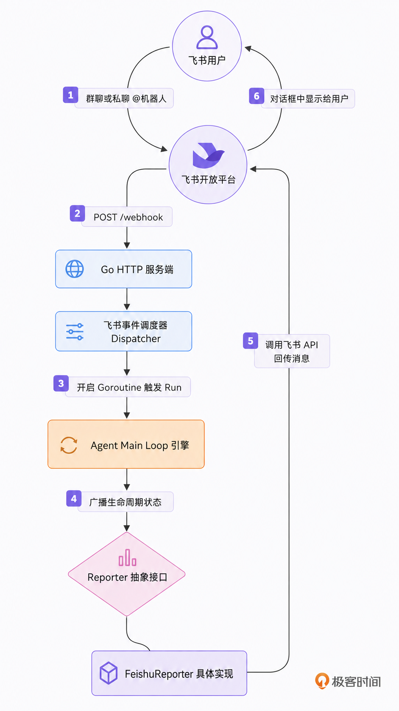

go get github.com/larksuite/oapi-sdk-go/v3

go-tiny-claw/
├── cmd/
│   └── claw/
│       └── main.go          # 【重构】启动 HTTP Server 监听飞书 Webhook
├── internal/
│   ├── engine/
│   │   ├── loop.go          # 【重构】将 fmt.Println 替换为 Reporter 接口调用
│   │   ├── reporter.go      # 【新增】定义 Reporter 接口规范
│   │   └── terminal_reporter.go # (本讲暂时用不到，预留给后续的 CLI)
│   ├── dispatch/              # 【新增】飞书集成层
│   │   └── feishu.go           # 实现事件监听与飞书消息 API 的封装
        └── wecom.go           # 实现事件监听与飞书消息 API 的封装
│   ├── provider/            # 保持不变
│   ├── schema/              # 保持不变
│   └── tools/               # 保持不变
├── go.mod
└── go.sum

// internal/engine/reporter.go
package engine

import "context"

// Reporter 定义了 Agent 引擎向外界输出信息的规范。
// 这使得引擎可以无缝切换终端 (CLI)、飞书、钉钉甚至 WebUI 等不同的展现层。
type Reporter interface {
// OnThinking 当模型开始进行慢思考 (Reasoning) 时调用
OnThinking(ctx context.Context)

    // OnToolCall 当模型决定并发调用工具时调用
    OnToolCall(ctx context.Context, toolName string, args string)

    // OnToolResult 当工具在底层执行完毕并返回结果时调用
    OnToolResult(ctx context.Context, toolName string, result string, isError bool)

    // OnMessage 当模型宣告任务完成，向用户输出最终纯文本回答时调用
    OnMessage(ctx context.Context, content string)
}

// internal/engine/loop.go
package engine

import (
"context"
"fmt"
"log"
"sync"

    "github.com/yourname/go-tiny-claw/internal/provider"
    "github.com/yourname/go-tiny-claw/internal/schema"
    "github.com/yourname/go-tiny-claw/internal/tools"
)

// ... 前置结构体定义不变 ...

// Run 方法新增了 Reporter 参数
func (e *AgentEngine) Run(ctx context.Context, userPrompt string, reporter Reporter) error {
log.Printf("[Engine] 引擎启动，锁定工作区: %s\n", e.WorkDir)

    contextHistory := []schema.Message{
        {Role: schema.RoleSystem, Content: "You are go-tiny-claw, an expert coding assistant."},
        {Role: schema.RoleUser, Content: userPrompt},
    }

    turnCount := 0

    for {
        turnCount++
        availableTools := e.registry.GetAvailableTools()

        // ================= Phase 1: Thinking =================
        if e.EnableThinking {
            if reporter != nil {
                // 【触发 Reporter】: 开始慢思考
                reporter.OnThinking(ctx)
            }

            thinkResp, err := e.provider.Generate(ctx, contextHistory, nil)
            if err != nil {
                return fmt.Errorf("Thinking 生成失败: %w", err)
            }
            if thinkResp.Content != "" {
                contextHistory = append(contextHistory, *thinkResp)
            }
        }

        // ================= Phase 2: Action =================
        actionResp, err := e.provider.Generate(ctx, contextHistory, availableTools)
        if err != nil {
            return fmt.Errorf("Action 生成失败: %w", err)
        }

        contextHistory = append(contextHistory, *actionResp)

        if actionResp.Content != "" && reporter != nil {
            // 【触发 Reporter】: 输出阶段性总结或最终回复
            reporter.OnMessage(ctx, actionResp.Content)
        }

        // ================= 执行退出与并发控制 =================
        if len(actionResp.ToolCalls) == 0 {
            break
        }

        observationMsgs := make([]schema.Message, len(actionResp.ToolCalls))
        var wg sync.WaitGroup

        for i, toolCall := range actionResp.ToolCalls {
            wg.Add(1)

            go func(idx int, call schema.ToolCall) {
                defer wg.Done()

                if reporter != nil {
                    // 【触发 Reporter】: 报告即将在底层执行的工具
                    reporter.OnToolCall(ctx, call.Name, string(call.Arguments))
                }

                result := e.registry.Execute(ctx, call)

                if reporter != nil {
                    // 为了防止大文件读取导致飞书消息过长被截断，我们仅汇报工具执行状态
                    // 注意：传递给大模型的 observationMsgs 依然是完整数据，只是人类看到的 Reporter 是缩略版
                    displayOutput := result.Output
                    if len(displayOutput) > 200 {
                        displayOutput = displayOutput[:200] + "... (已截断)"
                    }
                    // 【触发 Reporter】: 汇报工具物理执行的结果
                    reporter.OnToolResult(ctx, call.Name, displayOutput, result.IsError)
                }

                observationMsgs[idx] = schema.Message{
                    Role:       schema.RoleUser,
                    Content:    result.Output,
                    ToolCallID: call.ID,
                }
            }(i, toolCall)
        }

        wg.Wait()

        for _, obs := range observationMsgs {
            contextHistory = append(contextHistory, obs)
        }
    }

    return nil
}

// internal/feishu/bot.go
package feishu

import (
"context"
"encoding/json"
"fmt"
"log"
"os"
"strings"

    "github.com/larksuite/oapi-sdk-go/v3/event/dispatcher"
    larkim "github.com/larksuite/oapi-sdk-go/v3/service/im/v1"
    "github.com/yourname/go-tiny-claw/internal/engine"

    lark "github.com/larksuite/oapi-sdk-go/v3"
)

// FeishuBot 封装了飞书机器人的配置与核心业务流
type FeishuBot struct {
client    *lark.Client
appID     string
appSecret string
engine    *engine.AgentEngine // 持有核心引擎引用
}

func NewFeishuBot(eng *engine.AgentEngine) *FeishuBot {
appID := os.Getenv("FEISHU_APP_ID")
appSecret := os.Getenv("FEISHU_APP_SECRET")

    if appID == "" || appSecret == "" {
        log.Fatal("请设置 FEISHU_APP_ID 和 FEISHU_APP_SECRET")
    }

    // 实例化飞书官方客户端
    client := lark.NewClient(appID, appSecret)

    return &FeishuBot{
        client:    client,
        appID:     appID,
        appSecret: appSecret,
        engine:    eng,
    }
}

// GetEventDispatcher 用于注册到 HTTP 服务器，处理来自飞书的 POST 事件
func (b *FeishuBot) GetEventDispatcher() *dispatcher.EventDispatcher {
encryptKey := os.Getenv("FEISHU_ENCRYPT_KEY")
verifyToken := os.Getenv("FEISHU_VERIFY_TOKEN")

    // 使用官方 SDK 构建调度器，监听 "接收消息" 事件
    handler := dispatcher.NewEventDispatcher(verifyToken, encryptKey).
        OnP2MessageReceiveV1(func(ctx context.Context, event *larkim.P2MessageReceiveV1) error {
            // 由于飞书消息体是 JSON，我们需要粗略地提取其中的文本内容。
            // 这里简单处理：去掉开头结尾的特殊转义字符和引用的机器人名字。
            contentStr := *event.Event.Message.Content
            contentStr = strings.TrimPrefix(contentStr, `{"text":"`)
            contentStr = strings.TrimSuffix(contentStr, `"}`)

            chatId := *event.Event.Message.ChatId
            log.Printf("[Feishu] 收到会话 %s 消息: %s\n", chatId, contentStr)

            // 【驾驭并发】：收到消息后，绝不能阻塞 HTTP 回调。
            // 我们要为每个请求开启一个独立的 Goroutine 跑 Agent 任务！
            go b.handleAgentRun(chatId, contentStr)

            return nil
        }).
        OnP2MessageReadV1(func(ctx context.Context, event *larkim.P2MessageReadV1) error {
            // 消息已读事件，静默忽略（避免日志干扰）
            return nil
        })

    return handler
}

// handleAgentRun 是连接飞书与底层引擎的桥梁
func (b *FeishuBot) handleAgentRun(chatId string, prompt string) {
// 为当前聊天窗口实例化一个专属的 Reporter
reporter := &FeishuReporter{
client: b.client,
chatId: chatId,
}

    // 启动引擎！
    err := b.engine.Run(context.Background(), prompt, reporter)
    if err != nil {
        reporter.sendMsg(fmt.Sprintf("❌ Agent 运行崩溃: %v", err))
    }
}

// ==========================================
// FeishuReporter: 将引擎的输出格式化后发给飞书
// ==========================================
type FeishuReporter struct {
client *lark.Client
chatId string
}

// sendMsg 封装了调用飞书 OpenAPI 发送卡片/文本的操作
func (r *FeishuReporter) sendMsg(text string) {
// 构建文本消息内容
textContent := map[string]string{
"text": text,
}
contentBytes, _ := json.Marshal(textContent)
contentStr := string(contentBytes)

    msgReq := larkim.NewCreateMessageReqBuilder().
        ReceiveIdType(larkim.ReceiveIdTypeChatId).
        Body(larkim.NewCreateMessageReqBodyBuilder().
            ReceiveId(r.chatId).
            MsgType(larkim.MsgTypeText).
            Content(contentStr).
            Build()).
        Build()

    _, _ = r.client.Im.Message.Create(context.Background(), msgReq)
}

func (r *FeishuReporter) OnThinking(ctx context.Context) {
// 仅发一个轻量级提示，避免飞书刷屏
r.sendMsg("🤔 模型正在慢思考 (Thinking)...")
}

func (r *FeishuReporter) OnToolCall(ctx context.Context, toolName string, args string) {
r.sendMsg(fmt.Sprintf("🛠️ **正在执行工具**：`%s`\n参数：`%s`", toolName, args))
}

func (r *FeishuReporter) OnToolResult(ctx context.Context, toolName string, result string, isError bool) {
if isError {
r.sendMsg(fmt.Sprintf("⚠️ **执行报错** (%s)：\n%s", toolName, result))
} else {
// 成功时仅汇报成功，不刷全量日志
r.sendMsg(fmt.Sprintf("✅ **执行成功** (%s)", toolName))
}
}

func (r *FeishuReporter) OnMessage(ctx context.Context, content string) {
// 将模型最终的纯文本回答发给用户
r.sendMsg(content)
}

// 编译时类型检查：确保 FeishuReporter 实现了 Reporter 接口
var _ engine.Reporter = (*FeishuReporter)(nil)

// cmd/claw/main.go
package main

import (
"log"
"net/http"
"os"

    "github.com/larksuite/oapi-sdk-go/v3/core/httpserverext"
    "github.com/yourname/go-tiny-claw/internal/engine"
    "github.com/yourname/go-tiny-claw/internal/feishu"
    "github.com/yourname/go-tiny-claw/internal/provider"
    "github.com/yourname/go-tiny-claw/internal/tools"
)

func main() {
// 1. 初始化引擎依赖
workDir, _ := os.Getwd()

    // 默认使用智谱 GLM-4
    if os.Getenv("ZHIPU_API_KEY") == "" {
        log.Fatal("请先导出 ZHIPU_API_KEY 环境变量")
    }
    llmProvider := provider.NewZhipuOpenAIProvider("glm-4.5-air")

    registry := tools.NewRegistry()
    registry.Register(tools.NewReadFileTool(workDir))
    registry.Register(tools.NewWriteFileTool(workDir))
    registry.Register(tools.NewBashTool(workDir))
    registry.Register(tools.NewEditFileTool(workDir))

    // 开启慢思考
    eng := engine.NewAgentEngine(llmProvider, registry, workDir, true)

    // 2. 初始化飞书 Bot 调度器
    bot := feishu.NewFeishuBot(eng)
    handler := httpserverext.NewEventHandlerFunc(bot.GetEventDispatcher())

    // 3. 注册路由并启动 HTTP 服务
    http.HandleFunc("/webhook/event", handler)

    port := ":48080"
    log.Printf("🚀 go-tiny-claw 飞书服务端已启动，正在监听 %s 端口\n", port)

    err := http.ListenAndServe(port, nil)
    if err != nil {
        log.Fatalf("服务器启动失败: %v", err)
    }
}