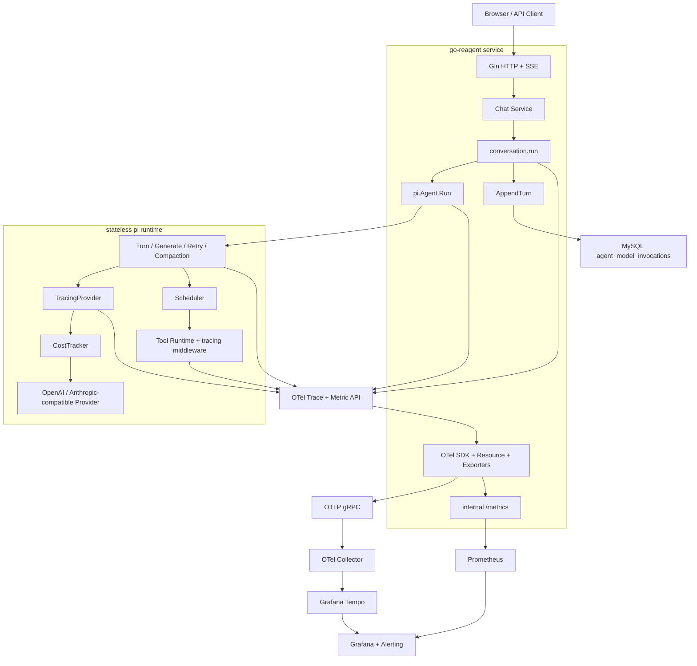

# Agent Tracing 与成本可观测性设计

> 状态：审阅稿（Proposed）
>
> 更新时间：2026-08-20
>
> 适用范围：go-reagent HTTP/Chat 服务、`pi` Agent Runtime、模型 Provider、Tool Runtime、Conversation 持久化；Multi-Agent 与 Replay 仅定义兼容边界。

## 1. 背景与结论

[`resources/tracing.md`](../../../resources/tracing.md) 中的手写 JSON Span Tree 适合作为理解 Agent Tracing 的教学实现，但不应直接作为 go-reagent 的生产实现。生产体系必须同时解决标准协议、跨进程传播、指标聚合、成本审计、采样、隐私和故障降级等问题。

go-reagent 采用以下四层模型：

1. **OpenTelemetry Trace**：记录 Run、Turn、模型调用、重试、Compaction、Tool 执行之间的因果关系、耗时、错误和并发。
2. **Prometheus Metrics**：记录吞吐、时延、错误率、Token、缓存命中率和成本等聚合趋势。
3. **MySQL Invocation Ledger**：沿用 `agent_model_invocations` 保存每次已完成且具有可信 Usage 的模型调用；它是成本审计事实源。
4. **Replay Artifact（后续独立项目）**：如未来需要完整回放，再显式保存模型和工具正文；第一阶段不实现，也不使用 OTel Span 代替。

总体原则是：

```text
Trace 回答：谁在何时调用了谁，耗时和错误在哪里？
Metrics 回答：系统整体是否健康，成本和性能趋势如何？
Ledger 回答：某次 Run 实际发生了多少可审计费用？
Replay 回答：模型和 Runtime 当时实际看到了、产生了什么？
```

### 1.1 本期目标

- 为每次 HTTP/Chat Run、`pi.Agent.Run`、Turn、逻辑 Generate、物理 Provider 请求、Compaction 和 Tool 执行建立 Span 因果链路，并用 Span Event 记录 Retry Wait。
- 通过 Prometheus 暴露吞吐、耗时、错误、Token 和成本聚合，并保证 Label 低基数。
- 保持 `pi` 无状态、可复用和厂商无关；OTel SDK、Exporter、监听端口与 MySQL 继续由服务层拥有。
- 已取得可信 Usage 的调用必须进入 `RunResult.Invocations`，即使后续 Thinking/Action/Compaction 契约校验失败。
- Telemetry 关闭或 Collector 不可用时，现有 Agent 行为、返回值和持久化语义不变。

### 1.2 非目标

- 第一阶段不保存 Prompt、Thinking、模型完整响应、Tool 参数正文或 Tool 输出正文。
- 第一阶段不建设 LangSmith 类 Prompt 版本管理、人工评分、Eval Dataset 或完整 Replay UI。
- 不把 Conversation、User、Profile 或 MySQL 依赖引入 `pi`。
- 不在本项目中推断或复刻 ChatGPT、Claude 等产品未公开的内部架构。
- 不以 Tracing 项目顺带替换现有 `float64` 公共成本契约；更换金额类型应独立设计并同步预算、配置与持久化。

## 2. 对教学实现的修正

生产实现不得照搬教学材料中的代码，原因包括：

- 自定义树没有 `trace_id`、`span_id`、`parent_span_id`、W3C Trace Context、Exporter、采样和 Span Link。
- `defer turnSpan.EndSpan()` 位于无限循环内，会在整个 Run 返回时才结束所有 Turn，导致前面 Turn 的耗时失真；应为单个 Turn 建立独立函数作用域。
- Prompt、Tool 参数和 Tool 输出可能包含密钥、个人信息、源码、绝对路径和业务数据，默认不能作为 Span Attribute 保存。
- JSON Tree 无法自然表达异步 Tool、长运行 Process、Multi-Agent 消息和非严格父子关系。
- Trace 不是完整回放记录。把全量输入输出塞入 OTel 会显著增加存储成本，并扩大数据泄露面。
- 秒级文件名可能碰撞，`0644` 文件权限不适合敏感调试制品，文件写入失败也不能被静默忽略。

因此，`resources/tracing.md` 保留为教学材料，go-reagent 的生产实现以本设计为准。

### 2.1 主流 Harness 的共同抽象

这里借鉴的是各产品和 SDK 公开接口所体现的工程模式，不推断 ChatGPT、Claude 等产品未公开的内部实现。

| 来源 | 借鉴点 | go-reagent 落点 | 不直接照搬的部分 |
|---|---|---|---|
| `pi` Agent SDK | 精简的 Agent Loop、Provider、Stream、Tool Runtime 边界 | 在 SDK 边界定义 Run、Turn、Generate、Provider、Tool 语义，由应用装配 OTel SDK | 不让 `pi` 依赖某个 Trace 后端或业务数据库 |
| OpenAI Responses / Agents 与 ChatGPT 公开能力 | 一次任务由模型生成、Tool 调用、Handoff/子任务等步骤组成；工作流与单次物理请求分层 | 使用 Run 作为根，逻辑 Generate 与物理 Provider Span 分离，未来 Handoff 使用子 Span 或 Span Link | 不绑定 OpenAI 专有 Trace 存储、事件名或 Dashboard |
| Anthropic API 与 Claude 类 Agent Loop | Tool Use 循环、长上下文、Prompt Caching、Extended Thinking 的独立语义 | 单独追踪 Compaction、Cache Read/Write Token；隐藏推理永不进入默认 Trace 或 Replay | 不把 Thinking 正文当作可观测数据，也不假设所有 Provider 都有相同缓存口径 |
| DeepSeek API | Reasoning 与最终回答可分离，Usage 暴露 Prompt Cache Hit/Miss | 统一 Reasoning Token 与 Cache Token，再保留 Provider 原始口径用于审计 | 不把 `reasoning_content` 写入 Span，不把 DeepSeek 字段扩散到 Harness 核心接口 |

四类体系的共同点不是某个厂商的 Span 名称，而是一条稳定的 Harness 事件主干：

```text
Run → Turn → Logical Generate → Physical Model Invocation
                         └────→ Tool Execution
                         └────→ Compaction / Retry
```

go-reagent 应先定义这条厂商无关的语义主干，再将同一事实分别投影到 Trace、Metrics、Ledger 和可选 Replay。这样更换模型 Provider 或观测后端时，不需要改 Agent Loop 的业务语义。

### 2.2 当前实现事实与约束

本设计以 2026-08-20 的仓库代码为准：

| 事实 | 当前位置 | 对设计的约束 |
|---|---|---|
| `pi.Agent.Run` 是同步、无状态入口 | `pi/agent.go` | Run/Turn 状态必须 request-local，不能存入共享 `Agent` 或 `Loop` 字段 |
| 外层 `for` 的一次迭代就是一个 Turn | `pi/loop.go` | Turn Span 必须覆盖可选 Thinking、Action 与该轮 Tool 批次 |
| Provider 返回 pull-based `ai.Stream` | `pi/ai/provider.go` | Provider Span 必须持续到 `Result` 或 `Close`，不能在 `Stream` 返回时结束 |
| Retry 与 Context Overflow 恢复位于生成流程 | `pi/recovery.go` | 每次物理请求、等待和 Compaction 必须可区分，不能只用一个 Provider Span |
| Tool 并发由 Scheduler 分波次执行 | `pi/scheduler.go` | Tool Span 在取得信号量并进入 `ToolRuntime.Execute` 后开始；并行 Span 允许重叠 |
| Tool Runtime 已有 Middleware 链 | `pi/middleware.go` | Tool Tracing 应实现为 Middleware，不在每个具体 Tool 内埋点 |
| 服务标准装配始终以 `CostTracker` 包装 Raw Provider，并由它完成调用计时和 Usage/成本补全 | `pi/harness/observability/tracker.go`、`pi/register.go` | TTFT 与 Latency 同属 Invocation 审计事实，由 CostTracker 单点测量；TracingProvider 只消费标准化 Usage 和包内 Timing Snapshot |
| `RunResult.Invocations` 是无状态 SDK 的成本输出 | `pi/contract.go` | `pi` 只记录 Invocation，不写 MySQL |
| Conversation 层持有 UserID、ConversationID、RunID | `conversation/store.go` | 业务标识只加在上层业务 Span，不增加到 `pi.RunRequest` |
| `AppendTurn` 原子保存消息与 Invocation | `conversation/runner.go` | Ledger 继续由服务层持久化；即使只有 Invocation、没有消息也要保存 |
| `agent_model_invocations` 是现有成本总账 | `migrations/0002_model_invocation_observability.up.sql` | 第一阶段扩展现有表，不平行新建另一套调用账本 |
| 当前没有 OTel SDK 或 Prometheus Exporter | `go.mod` | 需要新增标准依赖和服务级生命周期装配；间接 Jaeger 依赖不能视为已有 Tracing |

这些事实否定两个看似方便但破坏边界的方案：不得把 `RunMetadata` 塞入 `pi.RunRequest`，也不得让 `pi` 在每次模型调用后直接访问 MySQL。

## 3. 目标架构



生产默认组合为 OpenTelemetry Collector、Grafana Tempo、Prometheus 和 Grafana；本地开发可以用 Jaeger 替代 Tempo，但代码和 Span 语义不随后端改变。服务初始化 OTel SDK，通过 OTLP/gRPC 发送 Trace；Prometheus 从独立内部端口抓取 Metrics。

职责边界如下：

- `pi` 使用 OTel API 和项目语义门面产生 Span/Metric，不依赖 Collector、Tempo、Prometheus、Grafana 或 MySQL。
- `infrastructure/observability` 创建 TracerProvider、MeterProvider、Exporter、Resource、Propagator 和 Metrics Listener，并接入 Fx 生命周期。
- Conversation 层创建带业务 ID 的 `conversation.run` Span，并持久化 `RunResult.Invocations`。
- OTel 故障 Fail-open；MySQL Ledger 仍遵循现有业务持久化错误语义，不与 Exporter 故障混为一类。

一次 Chat Run 的数据流为：

```text
HTTP SERVER Span
→ Chat Service 创建 conversation.run Span，并写 run_id/conversation_id/profile_code
→ Conversation Runner 加载 History
→ pi.Agent.Run 创建 invoke_agent Span
→ Loop 创建 Turn/Generate/Compaction Span 和 Retry Event
→ TracingProvider 为每次物理请求创建 CLIENT Span
→ Tool Middleware 为每次实际执行创建 INTERNAL Span
→ pi 返回 RunResult{Invocations, Termination}
→ Conversation Runner 在 persist_turn Span 中原子保存消息和 Invocation
→ conversation.run 写入终止原因和 RunTotals 后结束
```

直接使用 `pi` 而不经过 Chat 服务时，`invoke_agent` 自然成为根 Span；SDK 调用方如需业务关联，只需在调用 `Run` 前创建父 Span，不需要修改 `pi.RunRequest`。

## 4. Trace 语义模型

### 4.1 标准调用树

```text
HTTP POST /api/v1/conversations/:id/runs
└── conversation.run
    ├── conversation.load_history
    ├── invoke_agent reagent
    │   ├── prepare_context
    │   └── reagent.turn [index=1]
    │       ├── reagent.generate [phase=thinking]
    │       │   └── chat deepseek-chat [attempt=1]
    │       ├── reagent.generate [phase=action]
    │       │   ├── chat deepseek-chat [attempt=1, context_overflow]
    │       │   ├── reagent.compact_context [reason=overflow]
    │       │   │   └── chat deepseek-chat [phase=compaction, attempt=1]
    │       │   └── chat deepseek-chat [attempt=2]
    │       ├── execute_tool read
    │       ├── execute_tool exec
    │       └── execute_tool edit
    └── conversation.persist_turn
```

并行 Tool 必须成为同一个 Turn 下的平行子 Span，其时间区间允许重叠。

### 4.2 业务 Run 与 Agent Run Span

Chat 服务创建 `conversation.run` INTERNAL Span，承载只属于业务层的属性：

| 属性 | 类型 | 说明 |
|---|---|---|
| `reagent.run.id` | string | `conversation.RunRequest.RunID`，仅用于 Trace |
| `gen_ai.conversation.id` | string | 业务 Conversation ID，仅用于 Trace |
| `reagent.profile.code` | string | 当前 Agent Profile Code |
| `reagent.run.transport` | enum | `http_sse`、`terminal`、`wecom`、`sdk` |
| `reagent.persistence.enabled` | bool | 本次是否启用 Conversation 持久化 |

`user_id` 不写入 Span、Metrics Label 或 Baggage；按 Run/Conversation 检索已经足以完成本期排查。

Span 名称固定为：

```text
invoke_agent reagent
```

属性：

| 属性 | 类型 | 说明 |
|---|---|---|
| `gen_ai.operation.name` | string | 固定为 `invoke_agent` |
| `gen_ai.agent.name` | string | Agent 名称，如 `reagent` |
| `gen_ai.agent.version` | string | Agent 的发布版本；独立 Prompt、Profile 或配置版本不得复用该字段，未来需要时使用 `reagent.*` 自定义属性 |
| `reagent.termination.reason` | enum | completed、error、canceled、deadline_exceeded、max_turns、max_cost、max_total_tokens、loop_detected |
| `reagent.run.turns` | int | 已开始的 Turn 数 |
| `reagent.run.invocations` | int | 已记录模型调用数 |
| `reagent.run.total_tokens` | int | 本次 Run 总 Token |
| `reagent.run.cost_usd` | double | 本次 Run 总成本 |

`pi` 不读取父 Span 的业务属性，也不复制它们。Trace 关联由传入的 `context.Context` 自动完成。

### 4.3 Turn Span

Span 名称固定为 `reagent.turn`，Turn 序号只能作为属性，不能拼入 Span 名称。

| 属性 | 类型 | 说明 |
|---|---|---|
| `reagent.turn.index` | int | 从 1 开始的 Turn 序号 |
| `reagent.context.message_count` | int | 实际送入生成流程的消息数 |
| `reagent.context.estimated_tokens` | int | 可得时记录估算 Token |
| `reagent.tools.available_count` | int | 当前可用工具数 |
| `reagent.tools.requested_count` | int | 模型本 Turn 请求的工具数 |
| `reagent.tools.execution_mode` | enum | serial、parallel、mixed |

实现时应抽出 `runTurn` 或等价的单 Turn 函数，让 `defer span.End()` 的作用域只覆盖当前 Turn。

### 4.4 逻辑 Generate Span

`reagent.generate` 是 INTERNAL Span，只表示 Thinking 或 Action 的一次逻辑生成。一次逻辑生成可能包含多个真实 Provider 请求以及一次 Context Compaction；Compaction 自己使用独立 Span。

| 属性 | 类型 | 说明 |
|---|---|---|
| `reagent.generation.phase` | enum | thinking、action |
| `reagent.generation.attempts` | int | 实际 Provider 请求次数 |
| `reagent.generation.outcome` | enum | succeeded、failed、canceled |
| `reagent.compaction.triggered` | bool | 是否在本次逻辑生成中触发 Compaction |

例如第一次 Action 请求发生 Context Overflow，随后 Compaction 和重试成功：第一次 Provider Span 标记错误，Generate Span 的最终 Outcome 仍为 `succeeded`，同时 `reagent.compaction.triggered=true`。

### 4.5 Provider 请求 Span

每次真实 Provider 请求必须创建独立 CLIENT Span，包括初次请求、Transient Retry、Rate Limit Retry、Compaction 请求和 Context Overflow 后的重试。

Span 名称遵循：

```text
chat {model}
```

例如 `chat deepseek-chat`、`chat claude-sonnet`。

属性：

| 属性 | 类型 | 说明 |
|---|---|---|
| `gen_ai.operation.name` | string | 固定为 `chat` |
| `gen_ai.provider.name` | string | Provider 名称 |
| `gen_ai.request.model` | string | 请求模型 |
| `gen_ai.response.model` | string | Provider 返回的具体模型，可得时记录 |
| `gen_ai.response.finish_reasons` | string[] | 统一结束原因 |
| `gen_ai.usage.input_tokens` | int | 总输入 Token |
| `gen_ai.usage.output_tokens` | int | 总输出 Token |
| `reagent.usage.cache_read_tokens` | int | 缓存读取 Token；项目扩展 |
| `reagent.usage.cache_write_tokens` | int | 缓存写入 Token；项目扩展 |
| `reagent.usage.reasoning_tokens` | int | 推理 Token；项目扩展 |
| `reagent.generation.phase` | enum | thinking、action、compaction |
| `reagent.provider.attempt` | int | 从 1 开始的请求次数 |
| `reagent.stream.chunk_count` | int | 流式 Chunk 数 |
| `reagent.stream.ttft_ms` | int | CostTracker 从调用开始到首个非空 Text Delta 的延迟；纯 Tool Call 响应缺省；与 TTFT Histogram、Ledger 使用同一个 Timing Snapshot |
| `reagent.invocation.cost_usd` | double | 本次调用成本 |
| `reagent.provider.request_index` | int | Run 内每次物理 Provider 请求的单调序号 |
| `error.type` | string | 稳定、低基数的错误类型 |

Provider 返回可信 Usage 后才写 Token 和成本。失败请求没有可信 Usage 时仍保留请求 Span、耗时、Attempt、Request Index 和错误类型，但不得填充估算成本。

### 4.6 Tool Span

Span 名称遵循：

```text
execute_tool {tool_name}
```

属性：

| 属性 | 类型 | 说明 |
|---|---|---|
| `gen_ai.operation.name` | string | 固定为 `execute_tool` |
| `gen_ai.tool.name` | string | Tool 名称 |
| `gen_ai.tool.call.id` | string | Tool Call ID，仅用于 Trace；可得时按 OTel GenAI 约定记录 |
| `reagent.tool.parallel_safe` | bool | 是否允许并行 |
| `reagent.tool.is_error` | bool | Tool 是否返回错误 |
| `reagent.error.code` | string | 项目稳定错误码 |
| `reagent.tool.arguments_size` | int | 参数字节数 |
| `reagent.tool.output_size` | int | 输出字节数 |

Tool Span 在 Scheduler 获得并发许可、进入 `ToolRuntime` 后开始，以便执行耗时不混入信号量等待时间。实现为 `Order=5` 的默认 `tracing` Middleware，位于现有 Panic Recovery、Schema Validation、Logging 和 Event Forwarding 之外，使这些步骤与真实 Tool 调用都处于 Span 内。未注册 Tool 在 Registry Lookup 阶段返回，不伪装成真实执行；Turn Span 记录稳定错误码，Metrics 的 Tool Label 映射为 `unknown`。

排队时间从 Goroutine 开始等待信号量时计时，到获得信号量或 Context 取消时结束，只进入 `reagent.tool.queue_duration` Histogram，不额外创建高频 Queue Span。

### 4.7 Compaction Span

Span 名称固定为 `reagent.compact_context`。

| 属性 | 类型 | 说明 |
|---|---|---|
| `reagent.compaction.reason` | enum | overflow、threshold、manual |
| `reagent.compaction.before_message_count` | int | 压缩前消息数 |
| `reagent.compaction.after_message_count` | int | 压缩后消息数 |
| `reagent.compaction.before_tokens` | int | 压缩前 Token，可得时记录 |
| `reagent.compaction.after_tokens` | int | 压缩后 Token，可得时记录 |
| `reagent.compaction.summary_tokens` | int | 摘要模型输出 Token |

当前实现只有 Overflow 触发，因此第一阶段 `reason` 只产生 `overflow`；`threshold`、`manual` 是保留枚举。没有确定性 Token Estimator 时省略 before/after Token，不能用字符数冒充 Provider Token。

### 4.8 Retry Wait Event

Retry 等待不是独立的远程调用或 Runtime 操作，不创建 `reagent.retry_sleep` Span，而是在所属的 `reagent.generate` Span 上记录事件。这样仍能在相邻 Provider Span 之间解释等待时间，同时避免为短暂 Backoff 增加瀑布图噪声。

| Event | 记录时机 | 属性 |
|---|---|---|
| `reagent.retry.scheduled` | 启动等待前 | `reagent.retry.next_attempt`、`reagent.retry.delay_ms`、`reagent.retry.reason` |
| `reagent.retry.completed` | Timer 正常到期 | `reagent.retry.next_attempt`、`reagent.retry.actual_delay_ms` |
| `reagent.retry.canceled` | 等待被 Context 取消或超时 | `reagent.retry.next_attempt`、`reagent.retry.actual_delay_ms`、`reagent.retry.cancel_reason`（`context_canceled`、`deadline_exceeded`） |

`next_attempt` 与下一次 Provider Span 的 `reagent.provider.attempt` 使用同一序号，从 2 开始。`reagent.model.retries` Counter 只在记录 `reagent.retry.scheduled` 时累加一次；完成和取消事件不能重复计数。Retry Wait 不单独创建 Duration Histogram，其实际耗时由事件时间戳和相邻 Provider Span 的时间区间确定。

### 4.9 Span Status、Error 与取消

- 成功 Span 保持 OTel 默认 `Unset` Status，不显式写 `Ok`。
- 操作因自身失败而结束时设置 `Error` Status，描述使用稳定错误码，不写完整错误正文。
- 使用 `RecordError` 时必须先经过错误清洗；Provider 响应体、Prompt、Tool 输出和数据库 DSN 不得进入 Exception Event。
- Context Cancel 与 Deadline 分别使用 `canceled`、`deadline_exceeded`，不得都归类为普通 `error`。
- 子 Span 失败但父流程恢复成功时，失败子 Span 保持 Error，父 Generate/Run 按最终 Outcome 结束。
- Tool 返回业务性 `IsError=true` 时 Tool Span 设置 Error；Scheduler 成功返回这类结果不自动把整个 Run 标记为内部错误。

## 5. 流式 Provider 的 Span 生命周期

当前 Provider 返回 `ai.Stream`，因此不能在 `Stream()` 返回时结束 Span。标准装饰顺序仍为 `TracingProvider → CostTracker → Raw Provider`，但 Invocation Timing 的所有权属于 Ledger-enabled 服务必须装配的 CostTracker。正确生命周期为：

```text
TracingProvider.Stream
    → 创建 Provider Span
    → 调用 CostTracker.Stream
        → 在调用 Raw Provider.Stream 前记录 startedAt
        → 返回 trackingStream
    → 返回 tracingStream

tracingStream.Next（外层）
    → 调用 trackingStream.Next
        → 消费 Raw Stream Event
        → 首个非空 Text Delta 单点记录 TTFT 与 observed=true
    → 统计 Chunk 数
    → 通过包内 streamTimingReader 读取同一个 Timing Snapshot
    → 首次 observed 时写入 Span 和可选 TTFT Histogram
    → 不因 Next 返回 false 自动结束 Span

tracingStream.Result
    → 调用下层 CostTracker.Result
        → 获取最终 Usage
        → 补齐 Platform、Model、价格、Cost、LatencyMS
        → observed=true 时把同一 TTFT 写入 Usage.TTFTMS
    → 从最终 Usage 写入 Span 属性和其他 Metrics
    → 结束 Span

tracingStream.Close
    → 如果 Result 未调用，标记 abandoned/canceled
    → 始终调用下层 Close
    → 如已 observed，保留先前写入的 TTFT
    → 结束 Span
```

Span 结束必须使用 `sync.Once` 或等价机制，确保正常完成、Provider 错误、Context Cancel、Deadline、提前 Close 和重复 Result 均只结束一次。

`trackingStream` 保存 request-local Timing Snapshot，并通过 `pi/harness/observability` 包内私有接口暴露给外层 TracingProvider，例如：

```go
type streamTimingReader interface {
    StreamTTFT() (time.Duration, bool)
}
```

这不修改公共 `ai.Provider` 或 `ai.Stream` 接口。TracingProvider 在标准链路中不得启动第二个 TTFT 计时器；它把 Snapshot 的整数毫秒写入 Span，把同一 `time.Duration` 转换为秒写入 `reagent.model.ttft` Histogram。即使首个 Text Delta 后 Stream 失败或被提前 Close，Snapshot 仍可供 Trace 使用；只有成功且取得可信 Usage 的调用才把 TTFT 带入 Invocation/Ledger。

纯 Tool Call 响应没有 Text Delta 时，`observed=false`，Span、Metric、Usage 和 Ledger 均省略 TTFT。TracingProvider 被单独用于未实现 `streamTimingReader` 的自定义 Provider 时，可以进行只供 Trace 使用的本地兜底测量，但该值不得回写 Usage 或进入 Ledger；标准应用无论 Telemetry 启用、Noop 或完全移除 TracingProvider，CostTracker 都必须继续产生一致的 Invocation Timing。

调用方向固定为：

```text
Loop → TracingProvider → CostTracker → Raw Provider
```

该顺序保证 TracingProvider 能消费 CostTracker 已补齐的 Platform、Model、价格、Cost、Latency 和 TTFT，同时 CostTracker 不依赖 OTel。Trace 记录的 Provider 总时延使用 Span Duration；Ledger 沿用 CostTracker 的 `LatencyMS`，两者允许因装饰器开销存在毫秒级差异。TTFT 则严格复用 CostTracker 的 Snapshot，不允许产生第二套口径。

## 6. Telemetry 包边界

建议在现有 `pi/harness/observability` 下形成以下职责边界：

```text
pi/harness/observability/
├── telemetry.go          # Telemetry、Noop 和构造
├── attributes.go         # 属性名、枚举和基数声明
├── spans.go              # Run/Turn/Generate/Tool 等 Span
├── provider.go           # TracingProvider、tracingStream 和包内 Timing Reader
├── metrics.go            # OTel Meter Instruments
├── content_policy.go     # 第一阶段固定 none；为后续受控模式保留边界
└── tracker.go            # CostTracker、trackingStream 和 canonical Invocation Timing
```

应用层负责 OTel SDK 和基础设施装配：

```text
infrastructure/observability/
├── register.go           # Fx Module
├── sdk.go                # TracerProvider/MeterProvider/Exporter
├── metrics_server.go     # 独立 Metrics Listener
├── resource.go           # service.name/version/environment
└── lifecycle.go          # ForceFlush/Shutdown
```

`Telemetry` 是项目语义门面，底层仍使用标准 OTel：

```go
type Telemetry struct {
    tracer  trace.Tracer
    meter   metric.Meter
    metrics *Metrics
    content ContentPolicy
}
```

构造函数只接收 OTel API 层的 `trace.TracerProvider` 与 `metric.MeterProvider`，不接收 OTLP Endpoint 或 Prometheus Handler。`pi/register.go` 通过 Fx Optional 参数取得服务层 Provider；缺省时显式使用 OTel Noop Provider。Instrument 在应用启动时创建一次，不能在每个 Run 中重复注册。

业务代码不得散落 `if observabilityEnabled` 判断，也不得因 Telemetry 故障改变 Agent 的业务结果。Span Helper 返回的新 Context 必须继续传给下游；不得只创建 Span 却继续使用旧 Context。

## 7. Context 传播与业务元数据

业务 ID 不需要进入 `pi.RunRequest`。Conversation 层在调用 `pi.Runner.Run` 前创建父 Span：

```go
ctx, span := tracer.Start(ctx, "conversation.run",
    trace.WithAttributes(
        attribute.String("reagent.run.id", request.RunID),
        attribute.String("gen_ai.conversation.id", request.ConversationID),
        attribute.String("reagent.profile.code", profileCode),
    ),
)
defer span.End()

result, err := runtime.Run(ctx, piRequest, reporter)
```

`pi.Agent.Run` 从这个 Context 创建 `invoke_agent` 子 Span，后续 Context 经 Loop、Provider、Scheduler 和 Tool Runtime 原样透传。这样同时满足：

- `pi` 不解释业务 ID；
- 业务 Trace 可以按 Run/Conversation 检索；
- 直接 SDK 调用者可以选择自己的父 Span 和属性；
- 现有 `pi.RunRequest` JSON、校验和无状态边界不变。

HTTP 入口使用 OTel Gin Middleware 提取或创建 W3C `traceparent`/`tracestate`。远程 MCP Client 只向允许传播的目标注入这两个 Header；不把 API Key、UserID、ConversationID 或 RunID 放入 Baggage。异步任务需要显式保存 Span Context，并在新执行单元中创建 Child Span 或 Span Link。

TracingProvider 需要知道当前 Phase 和 Attempt，但不应修改 `ai.Provider` 公共接口。`pi` 在每次 `provider.Stream` 前通过私有、强类型 Context Key 写入只供观测使用的 Generation Hint：

```go
type GenerationHint struct {
    Phase        string // thinking | action | compaction
    Attempt      int    // 当前逻辑生成内从 1 开始
    RequestIndex uint32 // 当前 Run 内每次物理请求前递增
}
```

Hint 不序列化、不跨进程传播、不允许携带 Prompt 或业务 ID。TracingProvider 读取不到 Hint 时使用 `phase=unknown`、`attempt=1` 并省略 Request Index，保证直接 Provider 调用仍可观测。

`generateWithRetry` 必须把最终成功请求的 Request Index 与 Message 一起返回；`pi.ModelInvocation` 增加 `ProviderRequestIndex`。这样失败重试、Compaction 和成功请求各有独立物理序号，而 Invocation Sequence 仍只表示可信、已计量调用的顺序。

## 8. Prometheus Metrics 规范

应用使用 OTel Meter 创建 Instrument，由 Prometheus Exporter 暴露。名称在代码中使用 OTel 风格，最终由 Exporter 转换成 Prometheus 名称。

指标按交付优先级分为两档：P0 是阶段 0–3 必须上线并纳入基础 Dashboard/告警的最小闭环；P1 保留目标语义和 Instrument 定义，在阶段 5 根据容量与排障价值启用。P1 延后不允许改变名称、单位或 Label 口径，也不能阻塞 P0 上线。

### 8.1 Agent Metrics

| 指标 | 类型 | Labels | 优先级 |
|---|---|---|---|
| `reagent.agent.runs` | Counter | agent、termination_reason | P0 |
| `reagent.agent.run.duration` | Histogram(s) | agent、termination_reason | P0 |
| `reagent.agent.run.turns` | 无单位 Histogram（OTel unit=`1`） | agent | P1 |
| `reagent.agent.run.invocations` | 无单位 Histogram（OTel unit=`1`） | agent | P1 |
| `reagent.chat.runs` | Counter | profile、transport、termination_reason | P1 |

前四项由 `pi` 产生，不依赖业务 Profile；`reagent.chat.runs` 由 Chat Service 产生。不得为了给 `pi` 指标增加 Profile Label 而修改 `pi.RunRequest`。

### 8.2 Model Metrics

实现时必须从 OpenTelemetry 独立的 `semantic-conventions-genai` 仓库固定一个 release；上游尚未发布可用 release 时固定 commit，并在 `attributes.go` 文件头记录来源仓库和精确 revision。仍处于 Development 状态的名称统一封装在该文件，避免上游改名扩散到业务代码。标准指标可用时采用 P0 的 `gen_ai.client.operation.duration` 与 `gen_ai.client.token.usage`；项目补充：

| 指标 | 类型 | Labels | 优先级 |
|---|---|---|---|
| `reagent.model.requests` | Counter | provider、model、phase、outcome、error_code | P0 |
| `reagent.model.invocations` | Counter | provider、model、phase、acceptance | P0 |
| `reagent.model.cost` | Counter(USD) | provider、model、phase、cost_quality | P0 |
| `reagent.model.tokens` | Counter | provider、model、phase、token_type | P0 |
| `reagent.model.ttft` | Histogram(s) | provider、model、phase | P1 |
| `reagent.model.retries` | Counter | provider、model、phase、reason | P0 |
| `reagent.model.context_overflows` | Counter | provider、model、phase | P0 |

`token_type` 是固定枚举：`input_total`、`output_total`、`cache_read`、`cache_write`、`reasoning`。后三项是前两项的子集，Dashboard 不得把所有 Token Type 直接求和。

`requests` 统计每次物理 Provider 请求，`outcome` 只能是 `success`、`error`、`canceled`；`invocations` 只统计取得可信 Usage 的调用，`acceptance` 为 `accepted` 或 `contract_invalid`。Token 和 Cost 只在可信 Usage 路径累加一次。

### 8.3 Tool Metrics

| 指标 | 类型 | Labels | 优先级 |
|---|---|---|---|
| `reagent.tool.executions` | Counter | tool、outcome、error_code | P0 |
| `reagent.tool.duration` | Histogram(s) | tool、outcome | P0 |
| `reagent.tool.queue_duration` | Histogram(s) | tool、execution_mode、outcome | P1 |

### 8.4 Compaction Metrics

| 指标 | 类型 | Labels | 优先级 |
|---|---|---|---|
| `reagent.compactions` | Counter | reason、outcome | P0 |
| `reagent.compaction.duration` | Histogram(s) | reason、outcome | P1 |
| `reagent.compaction.message_reduction_ratio` | 无单位 Histogram（OTel unit=`1`） | reason | P1 |

`message_reduction_ratio = 1 - after_message_count / before_message_count`，只在 `before_message_count > 0` 时记录，并限制在 `[0,1]`。

### 8.5 Label 基数红线

以下字段禁止作为 Metrics Label：

```text
run_id, conversation_id, trace_id, span_id, user_id,
gen_ai.tool.call.id, session_id, 文件路径, 命令文本,
错误正文, Prompt, Model Response
```

它们只能进入 Span、日志、Ledger 或受控 Replay。

`agent`、`profile`、`provider`、`model`、`tool` 和 `error_code` 也必须来自配置或注册表中的有限集合；动态值统一映射为 `other`。上线前应通过集成测试统计每个 Label 的 Series 上限，不能仅凭字段名称判断其为低基数。

初始 Histogram Bucket 由显式 View 固定：

```text
Run duration:      0.1, 0.25, 0.5, 1, 2.5, 5, 10, 30, 60, 120, 300, 600 s
Provider duration: 0.01, 0.025, 0.05, 0.1, 0.25, 0.5, 1, 2.5, 5, 10, 30, 60 s
TTFT:              0.05, 0.1, 0.25, 0.5, 1, 2.5, 5, 10, 30 s
Tool duration:     0.005, 0.01, 0.025, 0.05, 0.1, 0.25, 0.5, 1, 2.5, 5, 10, 30, 60 s
Tool queue:        0.001, 0.005, 0.01, 0.025, 0.05, 0.1, 0.25, 0.5, 1, 2.5, 5 s
```

Prometheus Exporter 开启 Exemplar 后，Histogram 样本使用当前 Trace Context 关联 Trace；Trace ID 仍不得成为普通 Label。

## 9. 成本与 Usage 工程化

### 9.1 统一 Usage 模型

现有 `ai.Usage` 只有 Input/Output 两类 Token，并被 `RunLimits.MaxCostUSD`、配置、测试和持久化共同使用。Tracing 第一阶段保留这些字段和 `float64` 契约；Provider Usage 增强作为同一方案的第二阶段演进：

```go
type Usage struct {
    InputTokens      int64
    OutputTokens     int64
    CacheReadTokens  int64
    CacheWriteTokens int64
    ReasoningTokens  int64

    InputPriceUSDPerMillionTokens      float64
    CacheReadPriceUSDPerMillionTokens  float64
    CacheWritePriceUSDPerMillionTokens float64
    OutputPriceUSDPerMillionTokens     float64

    CostUSD     float64
    CostQuality CostQuality // exact | estimated
    LatencyMS   int64
    TTFTMS      *int64 // nil 表示未观测到 Text Delta

    PlatformID string
    Model      string
}
```

`LatencyMS` 对每次成功 Invocation 都存在；`TTFTMS` 使用指针表达可选事实，不能用 `0` 代表缺失，因为真实 TTFT 小于 1ms 时按毫秒取整同样可能得到 `0`。TTFT 在阶段 2 由 CostTracker 的 `trackingStream` 开始测量并供 Trace 使用，阶段 3 再进入 `Usage`、`ModelInvocation` 和 Ledger；Cache/Reasoning Usage 字段仍在阶段 4 增强。

`CostQuality=exact` 表示 Provider 返回的分项足以按配置价格重算；缺少缓存分项但 Provider 可能采用差异价格时只能标记 `estimated`。这比用零值冒充“没有缓存”更可审计。现有 MySQL `DECIMAL(20,12)` 继续保存价格和成本；浮点值必须通过现有有限值、范围及 `1e-12` 误差校验。全面替换为十进制 Go 类型会同时改变公开 Usage、Run Budget 和配置，不纳入本 Tracing 变更。

统一口径：

- `InputTokens` 是总输入 Token，包含 Cache Read/Write 子集。
- `CacheReadTokens` 是 InputTokens 的子集。
- `CacheWriteTokens` 是 Provider 支持时的输入子集。
- `OutputTokens` 是总输出 Token。
- `ReasoningTokens` 必须是 OutputTokens 的子集；无法归入该口径的 Provider 标记 `CostQuality=estimated`，不能静默改变总量公式。

成本公式：

```text
normal_input = input_tokens - cache_read_tokens - cache_write_tokens

cost =
  ( normal_input × input_price
  + cache_read_tokens × cache_read_price
  + cache_write_tokens × cache_write_price
  + output_tokens × output_price ) / 1_000_000
```

校验规则：

- Token 和价格均非负。
- `cache_read_tokens + cache_write_tokens <= input_tokens`。
- `reasoning_tokens <= output_tokens`，除非 Provider 适配器声明其他口径。
- 价格与成本不是 NaN 或 Inf，并落在现有 `DECIMAL(20,12)` 支持范围内。
- `CostQuality=exact` 时重算差值不超过 `1e-12`；`estimated` 不能混入“精确成本”报表。

### 9.2 Provider Usage 映射

DeepSeek：

```text
prompt_cache_hit_tokens  → CacheReadTokens
prompt_cache_miss_tokens → Normal Input Tokens
InputTokens = prompt_cache_hit_tokens + prompt_cache_miss_tokens
```

Anthropic：

```text
cache_read_input_tokens     → CacheReadTokens
cache_creation_input_tokens → CacheWriteTokens
InputTokens = input_tokens + cache_read_input_tokens + cache_creation_input_tokens
```

OpenAI：

```text
prompt_tokens_details.cached_tokens        → CacheReadTokens
completion_tokens_details.reasoning_tokens → ReasoningTokens
InputTokens = prompt_tokens；CacheReadTokens 是其子集
```

Provider 同时返回总量和分项时必须做一致性校验；只返回部分字段时必须设置 `CostQuality=estimated`，不得用猜测值进入精确成本报表。Provider 原始字段只在各 Adapter 内解析，不能扩散到 `pi.Loop` 或 Conversation 层。

### 9.3 台账记录时机

模型已经成功返回可信 Usage 后就已经发生费用，不能等 `ValidateThinking` 或 `ValidateAction` 通过后才记账。正确顺序是：

```text
Provider 返回成功
→ CostTracker 校验 Usage 并计算成本
→ Loop 立即创建并追加 ModelInvocation
→ Governor 累加 RunTotals 并判断预算
→ 执行 Thinking/Action 语义校验
→ 将 Invocation 标记为 accepted 或 contract_invalid
→ Run 返回后由 Conversation AppendTurn 原子写入消息与 Invocation
```

`pi.ModelInvocation` 增加 Outcome：`accepted`、`contract_invalid`。Provider Error 或 Canceled 没有可信 Usage 时不伪造 Invocation，只进入 Trace、请求计数和错误日志。创建 Invocation 与 Governor 累加必须发生在契约校验之前；契约错误和预算错误同时存在时，返回契约错误，但 Termination Totals 必须包含本次调用。

Conversation Runner 已按“存在 NewMessages 或 Invocations 就 AppendTurn”的条件保存部分结果。本设计保持这一事务边界，并沿用 `(conversation_id, turn_version, sequence)` 唯一约束避免同一 Turn 重复计费。持久化失败继续作为业务错误通过 `errors.Join` 返回，不转换为 OTel Exporter 错误。

同步 `Run` 结束后才执行 `AppendTurn`，因此进程在 Provider 已计费但 Run 尚未返回时崩溃，应用台账仍可能缺少该调用。第一阶段明确接受这个现有窗口，并通过 Provider 账单对账发现差异；若业务要求逐调用崩溃安全，必须另立 Service-owned Durable Invocation Sink/Outbox 设计，不能让 `pi` 直接写 MySQL。

Prometheus 成本是浮点聚合投影，MySQL Invocation Ledger 是应用侧配置口径的审计事实源；Provider 最终账单仍是外部结算事实源。

## 10. 数据持久化

### 10.1 扩展 agent_model_invocations

第一阶段建议增加：

```text
trace_id
provider_request_index
outcome
cost_quality
ttft_ms
finish_reason
error_code
```

第二阶段随 Usage 增强再增加：

```text
cache_read_tokens
cache_write_tokens
reasoning_tokens
cache_read_price_usd_per_million_tokens
cache_write_price_usd_per_million_tokens
```

`trace_id` 由 Conversation 层从当前 `conversation.run` SpanContext 取得，同一 Run 的 Invocation 共享它；具体 Provider Span 通过 `provider_request_index` 精确定位，因此第一阶段不冗余保存 `span_id`。同时补齐领域层 `compaction` phase，使其与现有 `pi.ModelInvocationPhaseCompaction` 一致。

`ttft_ms` 必须允许 `NULL`：只有 CostTracker 观测到非空 Text Delta 且调用最终取得可信 Usage 时才写入；纯 Tool Call 响应保持 `NULL`，合法的 `0` 表示 TTFT 已观测但不足 1ms。Conversation Mapper 只能复制 `Usage.TTFTMS`，不得自行计时或把 `nil` 转成 `0`。

对采样与保留策略最终保留下来的 Trace，排障入口固定为：先使用 Ledger 行中的 `trace_id` 直接取得整条 Trace，再在该 Trace 内使用 `reagent.provider.request_index=provider_request_index` 定位唯一 Provider Span。该路径不依赖跨 Trace 的全局 Attribute 搜索，但所选生产 Trace 后端和 UI/查询工具必须能够展示并过滤单条 Trace 内的 Span Attribute。未采样或已过保留期的 Trace 无法从 Ledger 恢复，Ledger 中的 `trace_id` 不能被解释为 Trace 后端永久存在性保证。

迁移必须为旧行提供兼容默认值：`outcome='accepted'`、`cost_quality='exact'`，新增 Token/价格字段非负。Repository Mapper 和 Migration Test 必须同步更新。

### 10.2 Run 汇总持久化决策

第一阶段不新增 `agent_runs`。原因是：当前业务持久化模型以 Conversation Turn 为事务边界，RunTotals 已由 `pi.RunResult.Termination.Totals` 返回；为 Tracing 强行引入 Run 表会扩大状态机、失败恢复和清理范围。

Run 的长期关联使用：

```text
run_id → agent_messages / agent_model_invocations
trace_id → Trace backend
run_id + trace_id → 结构化日志关联
```

如果后续产品需要在 Trace 过期后查询每次 Run 的终止原因、时延和完整汇总，再为该业务查询单独设计 `agent_runs`，不能把 Trace 后端当作永久业务数据库。

客户端取消后，已有 Invocation 的最终持久化不能继续使用已经取消的请求 Context。Conversation Runner 在存在 NewMessages 或 Invocations 时使用 `context.WithoutCancel(runCtx)`，再添加固定 3 秒独立超时执行 `AppendTurn`；超时或写入失败仍与原 Run Error 通过 `errors.Join` 返回。这个 Context 只允许用于终态持久化，不能继续调用模型或工具。

## 11. 内容、隐私与安全

第一阶段的内容策略固定为 `none`，只记录元数据、长度、状态和 Token，不采集可还原的模型或 Tool 正文。以下内容不得进入 Trace：

- API Key、Authorization、Cookie、密码、Token 和 OTP。
- `.env`、SSH 私钥、数据库连接串。
- Thinking、Chain of Thought 和隐藏推理内容。
- 未脱敏个人信息、完整源码和业务文件内容。

`content.mode` 第一阶段只接受 `none`，出现其他值时启动校验直接报错，不能静默退化。未来如需内容摘要、关联摘要或正文采集，必须另立 Replay/安全规格，至少完成显式授权、字段白名单、脱敏、密钥管理、保留期和删除机制评审；短路径、命令等低熵值不得使用普通 SHA-256 冒充不可逆匿名化。本设计不预定义未来模式名称、Tool 属性或正文上限。

## 12. 配置与生命周期

建议配置：

```json
{
  "observability": {
    "enabled": true,
    "service_name": "go-reagent",
    "environment": "development",
    "otlp": {
      "endpoint": "http://127.0.0.1:4317",
      "protocol": "grpc",
      "insecure": true,
      "timeout_seconds": 5,
      "max_queue_size": 2048,
      "max_export_batch_size": 512
    },
    "tracing": {
      "enabled": true,
      "sampling_mode": "head",
      "sample_ratio": 1.0
    },
    "metrics": {
      "enabled": true,
      "host": "127.0.0.1",
      "port": "9464",
      "path": "/metrics"
    },
    "content": {
      "mode": "none"
    }
  }
}
```

Metrics 使用独立内部监听端口，不直接暴露到公开 Chat HTTP 服务。

为保持兼容，`observability.enabled` 缺省为 `false`。`content.mode` 第一阶段只接受 `none`。配置校验还必须满足：

- `protocol` 第一阶段只能是 `grpc`；启用 Tracing 时 Endpoint 必须是合法 URL。
- `sample_ratio` 位于 `[0,1]`；`sampling_mode=tail` 时必须为 `1.0`，防止应用先丢弃异常 Trace。
- Queue、Batch、Timeout、Port 必须为正数，且 `max_export_batch_size <= max_queue_size`。
- `insecure=true` 只允许 Loopback 或明确的开发环境；生产 OTLP 使用 TLS。
- Metrics 监听默认绑定 `127.0.0.1:9464`；对集群网段开放由部署层 NetworkPolicy 控制。
- OTLP 认证信息只允许从环境变量或 Secret Provider 注入，不能写入可提交的 JSON。

OTel Resource 至少包含：

```text
service.name = go-reagent
service.version
deployment.environment.name
service.instance.id
host.name
process.runtime.name = go
```

Fx 生命周期：

```text
构造期:
  校验配置并创建 Resource、Exporter、TracerProvider、MeterProvider
  设置全局 TracerProvider 与 MeterProvider
  设置全局 W3C TraceContext Propagator

OnStart:
  初始化 Prometheus Listener

OnStop:
  停止 Metrics Listener
  ForceFlush
  Shutdown TracerProvider
  Shutdown MeterProvider
```

配置非法可以阻止启动；运行中 Collector 不可达、Exporter 超时或队列满不能让 Agent Run 失败。队列必须有界，Exporter 错误日志必须限频；Collector 自身的接收、丢弃、队列和导出指标由部署监控采集，不能把“应用成功创建 Span”误当作“后端已收到 Span”。

## 13. 采样与保留

支持两种互斥模式：

1. `head`：应用使用 `ParentBased(TraceIDRatioBased(sample_ratio))`。实现简单、资源可预测，是第一阶段默认；开发、预发以及阶段 2–4 的初期生产部署默认 `1.0`。只有完成 Trace 量、Exporter Queue 和 Collector 容量验证后，才允许在生产降低比例，并明确接受异常或高成本 Run 可能没有 Trace 的风险。
2. `tail`：应用使用 AlwaysOn，Collector 等 Root Span 结束后按结果采样。能完整保留异常 Run，但 Collector 需要按并发 Run 数配置内存和等待时间，属于运营阶段能力。

Tail Sampling 初始策略：

```text
100% 保留：
  error
  canceled/deadline
  context_overflow
  contract_invalid
  达到预算上限
  duration >= 30s
  cost_usd >= 1.0
  Tool failure

普通成功 Run：
  10% 采样
```

如果启用 Tail Sampling，应用 SDK 不能先做低比例 Head Sampling，否则 Collector 无法恢复已被应用丢弃的异常 Trace。Head 模式下未采样的异常仍必须体现在 Metrics 与结构化 Error Log 中。Metrics 永不采样。

Head Sampler 在 Root Span 创建时作出决定，此时最终 `cost_usd`、终止原因和 Tool 结果尚不可得，因此不得设计“Run 完成后按成本强制采样当前 Trace”的伪兜底；已经丢弃的 Span 无法事后恢复。基于输入长度、模型或预算上限的 Head 规则只能作为预测优化，不能宣称保证保留最终高成本 Run。如果生产验收要求错误、超时或 `cost_usd >= 1.0` 的 Run 100% 可追踪，必须把最小可用 Tail Sampling 从阶段 5 提前交付。

默认保留策略为 Trace 7 天、Metrics 30 天；MySQL Ledger 按现有 Conversation 数据保留策略处理。Replay 不在本期，因此不配置其保留期。部署可以延长，但缩短或扩大含业务标识的数据范围必须经过数据治理确认。

## 14. 日志关联

关键结构化日志从 Context 自动补充：

```text
trace_id
span_id
component
error_code
```

Service 层日志在可得时额外写 `run_id`；Loop 日志在可得时写 `turn`。`pi` 不为了日志从 Context 反向读取业务 ID。如果 `go-logger-sdk` 不会自动读取 OTel SpanContext，应提供统一的 `observability.TraceFields(ctx)` 并在现有日志入口复用。`trace_id` 可以进入日志，但禁止成为 Prometheus Label。

目标关联路径是：

```text
Metric → Exemplar → Trace → Related Logs → Run Ledger
```

## 15. Multi-Agent、异步 Tool 与 MCP

### 15.1 Multi-Agent

当前仓库没有 Multi-Agent Runtime，本期不创建相关接口。未来严格同步子任务可作为父 Tool/Handoff Span 的子 Agent Span；异步运行、队列消费或多父消息使用新 Trace + Span Link，不能强制拼成单棵嵌套树。跨 Agent 消息只传播 W3C SpanContext 和稳定消息 ID，不传播 Prompt 或隐藏推理。

### 15.2 长运行 Process

不能让一个 Span 因后台命令保持数小时：

```text
execute_tool exec [background/yield] → 短 Span，返回 session_id
execute_tool process [poll]          → 后续独立 Span
execute_tool process [write]         → 后续独立 Span
execute_tool process [kill/remove]   → 后续独立 Span
```

后续操作通过受控的 Process Session Correlation 或 Span Link 与首次执行关联。`session_id` 可以作为 Trace 属性，但不能成为 Metrics Label。

### 15.3 MCP

远程 MCP HTTP Transport 向配置允许的 Server 注入 `traceparent` 和 `tracestate`。MCP Tool 仍使用 `execute_tool` Span，底层 HTTP/SSE 请求是其子 CLIENT Span。禁止把外部入站 Baggage、Cookie 或 Authorization 复制到 MCP；MCP Header 继续只从现有受控配置加载。

## 16. Replay 子系统

Replay 不属于本期，当前实现不得创建 Replay 配置、Writer、目录或数据库表。`run_id`、OTel `trace_id`、Replay `replay_id` 必须始终是三个不同标识，避免把业务生命周期、观测保留期和回放制品生命周期耦合。

未来需要 Replay 时必须另立规格并完成威胁建模；至少满足显式启用、加密、独立保留期、可删除、写入 Fail-open 和禁止记录隐藏推理。本设计不提前规定 Replay 的目录、事件格式或 Reducer 架构。

## 17. Dashboard 与告警

以下面板中，依赖 P1 指标（Turn/Invocation 分布、TTFT、Tool 排队时延）或阶段 4 Usage 增强（Cache/Reasoning Token、缓存命中率、Exact/Estimated Cost 分布）的部分，随对应阶段启用，不要求在阶段 0–3 一次性交付完整 Dashboard。

### 17.1 Agent Dashboard

- Run 数量、成功率和各终止原因。
- P50/P95/P99 Run 时延。
- 平均 Turn 数和 Invocation 数。
- 每 Run 平均成本和 Token。

### 17.2 Model Dashboard

- Provider/Model 请求量和错误率。
- P95 请求时延与 TTFT。
- Input/Output/Cache/Reasoning Token。
- Retry、Rate Limit 和 Context Overflow。
- 每小时成本和每 Run 成本。
- Exact 与 Estimated Cost 分布。
- 缓存命中率。

### 17.3 Tool Dashboard

- Tool 调用量和错误率。
- P95 Tool 执行与排队时延。
- Tool 稳定错误码分布。
- 串行、并行和混合调度比例。

### 17.4 初始告警建议

```text
10 分钟 Run failure rate > 5%，且窗口内 Run >= 20
15 分钟 Provider P95 duration > 15s，且窗口内请求 >= 20
10 分钟 rate_limited 请求比例 > 1%，且窗口内请求 >= 20
10 分钟 context_overflow 比例 > 2%，且窗口内请求 >= 20
10 分钟 Tool error rate > 10%，且窗口内调用 >= 20
1 小时 reagent.model.cost 增量超过部署预算
Collector refused/dropped spans 连续 5 分钟 > 0
Prometheus 对应用 Metrics Endpoint 连续 3 次抓取失败
```

这些是可直接落地的初始阈值。运行两周后可以依据 P95 基线调整，但任何调整都必须保留最小样本条件，避免低流量单次失败触发告警。

## 18. 测试方法

### 18.1 单元测试

使用 OTel In-Memory Exporter 验证：

- Run、Turn、Generate、Provider 和 Tool 父子关系。
- Span 名称、属性、Status 和 Error Type。
- Cancellation、Deadline 和各预算终止原因。
- Noop Telemetry 不改变业务行为。
- Stream Span 恰好结束一次。
- 默认 Trace 不出现 Prompt、Thinking、Tool 参数和输出正文。
- 第一次请求 Overflow、Compaction、第二次请求成功时，父 Generate 成功而失败子 Span 保持 Error。
- Retry Wait 只产生 Generate Span Event，不产生独立 Sleep Span；Scheduled/Completed/Canceled Event 的 Attempt 与下一次 Provider Span 一致，Retry Counter 只累加一次。
- Provider 成功但 Thinking/Action/Compaction 契约非法时，Invocation Outcome 为 `contract_invalid` 且 RunTotals 已计入。

### 18.2 并发测试

构造至少两个并行 Tool，验证：

- 父 Span 相同。
- Span 时间区间重叠。
- 结果顺序仍符合 Scheduler 契约。
- `go test -race ./...` 无数据竞争。

### 18.3 流式测试

覆盖正常 Text Delta、Tool Call Delta、首 Chunk TTFT、中途错误、Result 重复调用、Close Before Result 和 Context Cancellation。

还必须断言下层 Stream 的 `Close` 总会被调用，并分别覆盖 `Next=false → Result` 与 Terminal Event → Result 两条消费路径。

TTFT 还必须验证：CostTracker 只在首个非空 Text Delta 写入一次 Snapshot；TracingProvider 的 Span/Histogram 与 Snapshot 同源；首个 Text Delta 后失败或提前 Close 时 Trace 仍有 TTFT、Ledger 无 Invocation；纯 Tool Call 的 `Usage.TTFTMS` 与 Ledger `ttft_ms` 为 `nil/NULL`；小于 1ms 的已观测 TTFT 可以合法写入 `0`。

### 18.4 成本测试

第一阶段覆盖现有 Input/Output、非法价格、NaN/Inf，以及“语义校验失败但 Invocation 仍返回并进入 Ledger”。第二阶段再覆盖 DeepSeek Cache Hit/Miss、Anthropic Cache Read/Write、OpenAI Cached/Reasoning Token、Cache Token 越界和 Exact/Estimated Cost 分流。

### 18.5 集成测试

- 使用测试 OTLP Receiver 执行完整 Agent Run。
- 验证 Trace 包含预期 Span 和关系。
- 抓取 Prometheus `/metrics`。
- 验证不存在高基数 Label。
- 验证 Collector 不可达时 Agent 仍成功。
- 验证 Metrics、RunTotals 和 MySQL Ledger 可对账。
- 在 Sampling `1.0` 且测试后端不丢弃 Trace 的环境中，从一行 `agent_model_invocations` 读取 `trace_id + provider_request_index`，定位且只定位到一个 Provider Span，并校验 Model、Phase、Token、Cost 和可选 TTFT 一致。
- 验证取消后的部分 Invocation 使用 3 秒独立 Context 尝试持久化。
- 验证 `pi/test/package_boundaries_test.go` 继续禁止 `pi` 导入 Service、Infrastructure 或 Persistence。

### 18.6 性能测试

使用 Fake Provider 和 Fake Tool 对比 Noop 与 Enabled；预热后各执行至少 1,000 次本地无网络 Run。验收目标为 P95 额外时延不超过 5%，每个 Run 的额外内存分配有基准记录，Exporter Queue 上限与配置一致，并通过 Goroutine Profile 证明高并发 Run 结束后无持续增长。

## 19. 分阶段实施

### 阶段 0：依赖、语义与配置

交付：

- 引入 OTel API/SDK、OTLP gRPC Trace Exporter、Prometheus Exporter 和 Gin OTel Middleware。
- 增加 `config.ObservabilityConfig`、校验、`config.example.json` 和 Noop 路径。
- 固定 Span/Metric 名称、P0/P1 优先级、属性枚举、Histogram View、内容策略和 Label 基数表。
- 增加属性与枚举单元测试，确保动态错误正文和业务 ID 不进入 Metrics。

验收：配置关闭时不创建网络连接和 Metrics Listener；非法配置在 Fx 启动前失败。

### 阶段 1：服务基础设施与入口关联

交付：

- 新建 `infrastructure/observability`，完成 Resource、Provider、Exporter、Metrics Server 和 Fx Shutdown。
- HTTP Middleware 提取 W3C Trace Context；Chat/Conversation 创建 `conversation.run`、load 和 persist Span。
- `go-logger-sdk` 日志补充 TraceID/SpanID。
- 提供本地 Collector + Tempo/Jaeger + Prometheus + Grafana 示例配置。

验收：完整 HTTP Run 可以从 Trace 跳到日志；Collector 不可用不改变 HTTP/Agent 结果。

### 阶段 2：核心 Trace

交付：

- `pi.Agent.Run` 的 `invoke_agent` Span 和单 Turn 函数作用域。
- Thinking/Action Generate、物理 Provider 和 Compaction Span，以及 Generate 上的 Retry Wait Event。
- CostTracker `trackingStream` 单点测量 Invocation TTFT，并通过包内 Timing Snapshot 供流式 `TracingProvider` 消费；TracingProvider 保证 Result/Close 只结束一次。
- 默认 Tool Tracing Middleware 与 Queue Duration 指标。
- MCP HTTP Transport 注入 W3C Trace Context，并验证不传播业务 Baggage。
- P0 Agent、Model、Tool、Compaction Metrics；P1 Instrument 保留定义但不阻塞本阶段。

验收：In-Memory Exporter 的 Span Tree/Event、并行时间区间、错误恢复、取消与 Noop 测试全部通过；初期生产使用 Head Sampling `1.0`，降低比例前必须记录容量验证与风险接受结论。

### 阶段 3：Invocation 与 Ledger 正确性

交付：

- `pi.ModelInvocation.Outcome`、`ProviderRequestIndex` 与可选 `Usage.TTFTMS`，并把可信 Usage 的记录与 Governor 累加移动到契约校验之前。
- Domain 补齐 `compaction` Phase，Invocation 表增加 Trace/Outcome/CostQuality 等第一阶段字段，`ttft_ms` 使用可空列并保留“未观测”与合法零值的区别。
- Conversation Mapper 写入当前 TraceID；取消后使用 3 秒终态持久化 Context。
- Metrics、RunTotals 与 MySQL Ledger 对账测试。

验收：契约非法、预算终止和取消场景均不丢失已返回的可信 Usage；事务失败仍明确返回业务错误；在 Sampling `1.0` 的验收环境中能够从 Ledger 行端到端定位唯一 Provider Span。

### 阶段 4：Provider Usage 增强

交付 DeepSeek Cache Hit/Miss、Anthropic Cache Read/Write、OpenAI Cached/Reasoning Token 归一化，扩展 Pricing、Usage、Migration、Dashboard，并区分 Exact/Estimated Cost。

验收：三类 Provider Fixture 的总量、分项、公式、非法响应和成本质量测试通过；现有只含 Input/Output 的调用方保持兼容。

### 阶段 5：运营体系

交付 Collector Tail Sampling、P1 Metrics、Grafana Dashboard、Prometheus Rules、数据保留、容量估算和故障排查 Runbook。如果生产上线前已要求异常或高成本 Run 100% 可追踪，Tail Sampling 必须提前，不得等待本阶段。Replay 不属于本实施序列，必须另立规格。

## 20. 验收标准

### 20.1 功能

- 每个 Run 恰好一个 Agent Run Span。
- 每个已开始 Turn 恰好一个 Turn Span。
- 每次真实 Provider 请求恰好一个 Span。
- 每次进入注册 Tool Handler 的执行恰好一个 Span。
- 并行 Tool 表现为平行 Span。
- Retry、Compaction、取消、Deadline 和预算终止可区分。
- Retry Wait 通过 Generate Span Event 表达，不创建独立 Sleep Span。
- Chat 请求具有 HTTP → conversation.run → invoke_agent 的连续父子关系，直接 SDK 调用不要求业务父 Span。

### 20.2 数据

- Prometheus 不存在高基数业务 ID Label。
- 默认 Trace 不包含 Prompt、Thinking 和 Tool 正文。
- 已产生可信 Usage 的模型调用不会因后续契约失败而从 `RunResult.Invocations` 丢失。
- Conversation 持久化沿用 `(conversation_id, turn_version, sequence)` 唯一约束；事务失败明确返回，不报告为成功落账。
- Metrics、RunTotals 和 MySQL Ledger 口径一致。
- 对 Trace 后端已保留的调用，Invocation Ledger 能通过 `trace_id + provider_request_index` 定位唯一 Provider Span；未采样或已过期 Trace 不作可恢复性承诺。
- 第二阶段 DeepSeek、Anthropic 和 OpenAI 的缓存/推理 Token 能正确映射，并区分 Exact/Estimated Cost。

### 20.3 可靠性

- Collector 不可用不影响 Agent。
- Exporter 队列和超时有明确上限。
- Shutdown 可以确定性 ForceFlush。
- `go test -race ./...` 通过。
- 1,000 次本地基准中 Telemetry 对 P95 Run 时延的额外影响不超过 5%。
- `pi` 不导入 Service、Infrastructure、Conversation 或 Persistence 包。

## 21. 正式需求表述

- **OBS-001 — Trace：** go-reagent 必须为业务 Run、Agent Run、Turn、模型逻辑生成、每次物理 Provider 请求、Context Compaction 和每次注册 Tool 执行创建结构化 OTel Span；Retry Wait 使用所属 Generate Span 上的结构化 Event 表达。系统必须通过 W3C Trace Context 保持 HTTP、MCP 和未来异步执行之间的调用关联。
- **OBS-002 — Metrics：** 系统必须通过 OTel Meter 暴露 Prometheus 指标，覆盖 Run、Turn、模型请求、Token、缓存、成本、TTFT、Retry、Compaction 和 Tool 执行，并按 P0/P1 分阶段交付。指标标签必须为受控低基数，禁止使用 run_id、trace_id、conversation_id、user_id、`gen_ai.tool.call.id`、路径和错误正文作为标签。
- **OBS-003 — Ledger：** `agent_model_invocations` 必须作为应用侧成本事实源，Prometheus 仅作为聚合投影。每次已产生可信 Usage 的模型调用，无论后续响应是否通过语义校验，都必须先进入 `RunResult.Invocations`；Conversation 层再按现有 Turn 事务和唯一约束持久化。任何启用 Invocation Ledger 的服务装配都必须包含 CostTracker；Latency 与 TTFT 等 Ledger 审计字段由它产生，不能依赖 Telemetry 是否启用，且未观测 TTFT 必须与合法零值区分。对 Trace 后端已保留的调用，Ledger 必须能通过 `trace_id + provider_request_index` 定位唯一 Provider Span；未采样或已过期 Trace 不作恢复承诺。进程崩溃窗口必须被明确记录，不能宣称应用账本等同 Provider 最终账单。
- **OBS-004 — Privacy：** 可观测链路默认不得采集 Prompt、Thinking、Tool 完整参数或输出。任何未来的完整运行回放必须作为独立、显式启用、加密并具有保留期的 Replay 子系统实现，不得使用 OTel Span 代替事件制品存储。
- **OBS-005 — Reliability：** OTel Telemetry 必须 Fail-open、队列有界、支持采样和确定性关闭；Exporter 或 Collector 故障不得改变 Agent 的业务结果。MySQL 写入失败仍按现有业务错误语义返回，不得被 Telemetry Fail-open 吞掉。
- **OBS-006 — Compatibility：** Telemetry 未启用时必须使用 Noop 实现，不能改变现有 Agent、Provider、Stream 和 Tool Runtime 的行为；厂商特有 Usage 必须在 Provider Adapter 中归一化，不能泄漏到 Harness 核心语义。
- **OBS-007 — Boundary：** `pi` 必须保持无状态且不拥有业务 ID、OTLP/Prometheus 部署配置或 MySQL；业务关联通过父 Context 完成，服务基础设施通过 OTel Provider 接口注入。

### 21.1 需求追踪矩阵

| 需求 | 设计章节 | 核心验证 |
|---|---|---|
| OBS-001 | 3、4、5、7、15 | In-Memory Span Tree/Event、W3C 传播、并行 Tool 测试 |
| OBS-002 | 8、12、17 | Metrics 抓取、Label 基数、Dashboard/Rule 测试 |
| OBS-003 | 5、9、10、18、19 | 契约非法仍计量、Noop TTFT、空值语义、事务/唯一约束、Ledger→Span 关联、对账测试 |
| OBS-004 | 11、16 | 敏感内容负向断言、非法 Content Mode 启动失败 |
| OBS-005 | 12、13、18 | Collector 不可达、Queue 上限、Shutdown 测试 |
| OBS-006 | 5、6、9、18 | Noop 等价、Provider Fixture、兼容测试 |
| OBS-007 | 2、3、6、7 | Package Boundary Test、直接 SDK Run 测试 |
