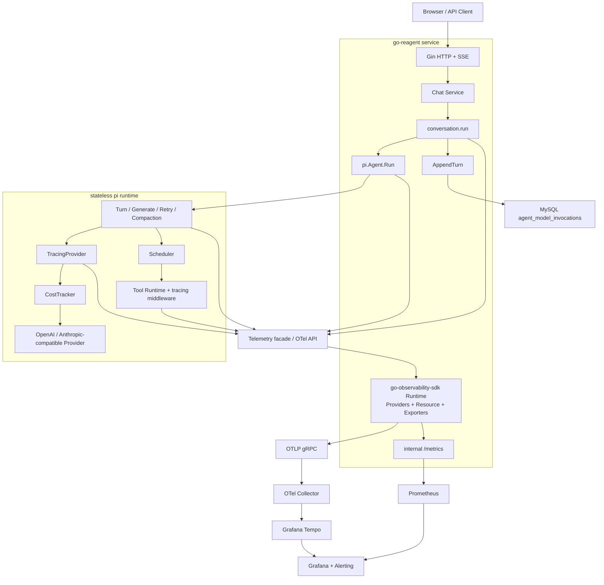

# Agent Tracing 与成本可观测性设计

> 状态：审阅稿（Proposed）
>
> 更新时间：2026-08-22
>
> 适用范围：go-reagent HTTP/Chat 服务、`pi` Agent Runtime、模型 Provider、Tool Runtime、Conversation 持久化；PycMono SDK 生态（go-observability-sdk、go-logger-sdk、go-context-sdk、go-gin-sdk）提供 OTel 基线；Multi-Agent 与 Replay 仅定义接口边界。

## 1. 结论与范围

[`resources/tracing.md`](../../../resources/tracing.md) 中的手写 JSON Span Tree 仅保留为教学实现。生产方案采用四层模型：

1. **OpenTelemetry Trace**：记录 Run、Turn、模型调用、重试、Compaction、Tool 执行之间的因果关系、耗时、错误和并发。
2. **Prometheus Metrics**：记录吞吐、时延、错误率、Token、缓存命中率和成本等聚合趋势。
3. **MySQL Invocation Ledger**：沿用 `agent_model_invocations` 保存每次已完成且具有可信 Usage 的模型调用；它是成本审计事实源。
4. **Replay Artifact（后续独立项目）**：如未来需要完整回放，再显式保存模型和工具正文；本期不实现，也不使用 OTel Span 代替。

```text
Trace 回答：谁在何时调用了谁，耗时和错误在哪里？
Metrics 回答：系统整体是否健康，成本和性能趋势如何？
Ledger 回答：某次 Run 实际发生了多少可审计费用？
Replay 回答：模型和 Runtime 当时实际看到了、产生了什么？
```

### 1.1 目标

- 为每次 HTTP/Chat Run、`pi.Agent.Run`、Turn、逻辑 Generate、物理 Provider 请求、Compaction 和 Tool 执行建立 Span 因果链路，并用 Span Event 记录 Retry Wait。
- 通过 Prometheus 暴露吞吐、耗时、错误、Token 和成本聚合，并保证 Label 低基数。
- 保持 `pi` 无状态、可复用和厂商无关；`go-observability-sdk` Runtime 统一拥有 OTel Provider、Exporter 和 Metrics Listener，go-reagent 服务层负责配置、Fx 生命周期与 MySQL。
- 已取得可信 Usage 的调用必须进入 `RunResult.Invocations`，即使后续 Thinking/Action/Compaction 契约校验失败。
- Telemetry 关闭或 Collector 不可用时，现有 Agent 行为、返回值和持久化语义不变。

### 1.2 非目标

- 默认不保存 Prompt、Thinking、模型完整响应、Tool 参数正文或 Tool 输出正文。
- 本期不建设 Prompt 版本管理、人工评分、Eval Dataset 或 Replay UI。
- 不把 Conversation、User、Profile 或 MySQL 依赖引入 `pi`。
- 不在本项目中推断或复刻 ChatGPT、Claude 等产品未公开的内部架构。
- 不以 Tracing 项目顺带替换现有 `float64` 公共成本契约；更换金额类型应独立设计并同步预算、配置与持久化。

## 2. 设计依据

教学实现不能直接用于生产：

- 自定义树没有 `trace_id`、`span_id`、`parent_span_id`、W3C Trace Context、Exporter、采样和 Span Link。
- `defer turnSpan.EndSpan()` 位于无限循环内，会在整个 Run 返回时才结束所有 Turn，导致前面 Turn 的耗时失真；应为单个 Turn 建立独立函数作用域。
- Prompt、Tool 参数和 Tool 输出可能包含密钥、个人信息、源码、绝对路径和业务数据，默认不能作为 Span Attribute 保存。
- JSON Tree 无法自然表达异步执行和非严格父子关系。
- Trace 不是完整回放记录。把全量输入输出塞入 OTel 会显著增加存储成本，并扩大数据泄露面。
- 秒级文件名可能碰撞，`0644` 文件权限不适合敏感调试制品，文件写入失败也不能被静默忽略。

公开 Agent SDK/API 共同体现的稳定主干是：

```text
Run → Turn → Logical Generate → Physical Model Invocation
                         └────→ Tool Execution
                         └────→ Compaction / Retry
```

同一事实分别投影到 Trace、Metrics、Ledger 和可选 Replay；Provider 或观测后端变化不应改变 Agent Loop 语义。

### 2.1 当前实现约束

| 事实 | 当前位置 | 对设计的约束 |
|---|---|---|
| `pi.Agent.Run` 是同步、无状态入口 | `pi/agent.go` | Run/Turn 状态必须 request-local，不能存入共享 `Agent` 或 `Loop` 字段 |
| 外层 `for` 的一次迭代就是一个 Turn | `pi/loop.go` | Turn Span 必须覆盖可选 Thinking、Action 与该轮 Tool 批次 |
| Provider 返回 pull-based `ai.Stream` | `pi/ai/provider.go` | Provider Span 必须持续到 `Result` 或 `Close`，不能在 `Stream` 返回时结束 |
| Retry 与 Context Overflow 恢复位于生成流程 | `pi/recovery.go` | 每次物理请求、等待和 Compaction 必须可区分，不能只用一个 Provider Span |
| Tool 并发由 Scheduler 分波次执行 | `pi/scheduler.go` | Tool Span 在取得信号量并进入 `ToolRuntime.Execute` 后开始；并行 Span 允许重叠 |
| Tool Runtime 已有 Middleware 链 | `pi/middleware.go` | Tool Tracing 应实现为 Middleware，不在每个具体 Tool 内埋点 |
| 服务标准装配始终以 `CostTracker` 包装 Raw Provider，并由它完成调用计时和 Usage/成本补全 | `pi/harness/observability/tracker.go`、`pi/register.go` | TTFT 与 Latency 同属 Invocation 审计事实，由 CostTracker 单点测量；TracingProvider 只消费标准化 Usage 和包内 Timing Snapshot |
| `RunResult.Invocations` 是无状态 SDK 的成本输出 | `pi/contract.go` | `pi` 只记录 Invocation，不写 MySQL |
| Conversation 层通过 `RunRequest` 接收 UserID、ConversationID、RunID | `conversation/store.go` | 业务标识只加在上层业务 Span，不增加到 `pi.RunRequest` |
| `AppendTurn` 原子保存消息与 Invocation | `conversation/runner.go` | Ledger 继续由服务层持久化；有 Invocation 时 Runner 必须进入终态持久化路径 |
| `agent_model_invocations` 是现有成本总账 | `migrations/0002_model_invocation_observability.up.sql` | 阶段 3 扩展现有表，不平行新建另一套调用账本 |
| 已升级 go-context-sdk v1.0.3、go-gin-sdk v0.0.7、go-logger-sdk v1.0.6，并通过模块图引入 go-observability-sdk v1.0.1 | `go.mod` | 复用已发布的 OTel Runtime 和 Gin Middleware；go-reagent 只实现领域语义与服务装配，接入 Runtime 时将 go-observability-sdk 提升为直接依赖 |

因此不得把业务 `RunMetadata` 塞入 `pi.RunRequest`，也不得让 `pi` 直接访问 MySQL。

## 3. 目标架构



生产默认使用 Collector、Tempo、Prometheus 和 Grafana；本地可用 Jaeger 替代 Tempo。服务通过 OTLP/gRPC 发送 Trace，Prometheus 从独立内部端口抓取 Metrics，代码语义不绑定后端。

- `pi` 使用 OTel API 和项目语义门面产生 Span/Metric，不依赖 Collector、Tempo、Prometheus、Grafana 或 MySQL。
- `go-observability-sdk` Runtime 创建 TracerProvider、MeterProvider、Exporter、Resource、W3C Propagator 和 Metrics Listener，并保证全局对象只有一个所有者。
- `infrastructure/driver/observability` 映射项目配置、注册领域 Metrics Definition、适配项目错误并将 Runtime 接入 Fx 生命周期，不重复创建上述基础设施。
- Conversation 层创建带业务 ID 的 `conversation.run` Span，并持久化 `RunResult.Invocations`。
- OTel 故障 Fail-open；MySQL Ledger 仍遵循现有业务持久化错误语义，不与 Exporter 故障混为一类。

```text
HTTP SERVER Span
→ Chat Service 创建 conversation.run Span，并写 run_id/conversation_id/profile_code
→ Conversation Runner 加载 History
→ pi.Agent.Run 创建 invoke_agent Span
→ Loop 创建 Turn/Generate/Compaction Span 和 Retry Event
→ TracingProvider 为每次物理请求创建 CLIENT Span
→ Tool Middleware 为每次实际执行创建 INTERNAL Span
→ pi 返回 RunResult{Invocations, Termination}
→ Conversation Runner 在 persist_turn Span 中原子保存消息和 Invocation
→ conversation.run 写入终止原因和 RunTotals 后结束
```

直接使用 `pi` 而不经过 Chat 服务时，`invoke_agent` 自然成为根 Span；SDK 调用方如需业务关联，只需在调用 `Run` 前创建父 Span，不需要修改 `pi.RunRequest`。

## 4. Trace 语义模型

### 4.1 标准调用树

```text
HTTP POST /api/v1/conversations/:id/runs
└── conversation.run
    ├── conversation.load_history
    ├── invoke_agent reagent
    │   ├── prepare_context
    │   └── reagent.turn [index=1]
    │       ├── reagent.generate [phase=thinking]
    │       │   └── chat deepseek-chat [attempt=1]
    │       ├── reagent.generate [phase=action]
    │       │   ├── chat deepseek-chat [attempt=1, context_overflow]
    │       │   ├── reagent.compact_context [reason=overflow]
    │       │   │   └── chat deepseek-chat [phase=compaction, attempt=1]
    │       │   └── chat deepseek-chat [attempt=2]
    │       ├── execute_tool read
    │       ├── execute_tool exec
    │       └── execute_tool edit
    └── conversation.persist_turn
```

并行 Tool 是同一 Turn 下时间区间可重叠的平行子 Span。

### 4.2 业务 Run 与 Agent Run Span

Chat 服务创建 `conversation.run` INTERNAL Span，记录业务层属性：

| 属性 | 类型 | 说明 |
|---|---|---|
| `reagent.run.id` | string | `conversation.RunRequest.RunID`，仅用于 Trace |
| `gen_ai.conversation.id` | string | 业务 Conversation ID，仅用于 Trace |
| `reagent.profile.code` | string | 当前 Agent Profile Code |
| `reagent.run.transport` | enum | `http_sse`、`terminal`、`wecom`、`sdk` |
| `reagent.persistence.enabled` | bool | 本次是否启用 Conversation 持久化 |

`user_id` 不写入 Span、Metrics Label 或 Baggage；按 Run/Conversation 检索已经足以完成本期排查。

`sdk` 仅用于 SDK 调用方显式创建的 `conversation.run` 父 Span；直接调用 `pi.Agent.Run` 时 `invoke_agent` 是根 Span，不记录该属性。

Agent Span 名称固定为 `invoke_agent reagent`，属性如下：

| 属性 | 类型 | 说明 |
|---|---|---|
| `gen_ai.operation.name` | string | 固定为 `invoke_agent` |
| `gen_ai.agent.name` | string | Agent 名称，如 `reagent` |
| `gen_ai.agent.version` | string | Agent 的发布版本；独立 Prompt、Profile 或配置版本不得复用该字段，未来需要时使用 `reagent.*` 自定义属性 |
| `reagent.termination.reason` | enum | completed、error、canceled、deadline_exceeded、max_turns、max_cost、max_total_tokens、loop_detected |
| `reagent.run.turns` | int | 已开始的 Turn 数 |
| `reagent.run.invocations` | int | 已记录模型调用数 |
| `reagent.run.total_tokens` | int | 本次 Run 总 Token |
| `reagent.run.cost_usd` | double | 本次 Run 总成本 |

`pi` 不读取父 Span 的业务属性，也不复制它们。Trace 关联由传入的 `context.Context` 自动完成。

### 4.3 Turn Span

Turn Span 固定为 `reagent.turn`，序号只能作为属性。

| 属性 | 类型 | 说明 |
|---|---|---|
| `reagent.turn.index` | int | 从 1 开始的 Turn 序号 |
| `reagent.context.message_count` | int | 实际送入生成流程的消息数 |
| `reagent.context.estimated_tokens` | int | 对实际模型可见请求投影调用 `TokenMeter.Estimate` 得到的估算 Token |
| `reagent.tools.available_count` | int | 当前可用工具数 |
| `reagent.tools.requested_count` | int | 模型本 Turn 请求的工具数 |
| `reagent.tools.execution_mode` | enum | serial、parallel、mixed |

实现时抽出单 Turn 函数，确保 `defer span.End()` 只覆盖当前 Turn。

### 4.4 逻辑 Generate Span

`reagent.generate` 是 Thinking 或 Action 的一次逻辑生成，可包含多个 Provider 请求和独立的 Compaction Span。

| 属性 | 类型 | 说明 |
|---|---|---|
| `reagent.generation.phase` | enum | thinking、action |
| `reagent.generation.attempts` | int | 实际 Provider 请求次数 |
| `reagent.generation.outcome` | enum | succeeded、failed、canceled、deadline_exceeded |
| `reagent.compaction.triggered` | bool | 是否在本次逻辑生成中触发 Compaction |

若 Overflow 后经 Compaction 重试成功，失败 Provider Span 保持 Error，Generate 最终为 `succeeded` 且 `reagent.compaction.triggered=true`。

### 4.5 Provider 请求 Span

每次真实 Provider 请求（初次、Retry、Compaction、Overflow 后重试）创建独立 CLIENT Span，名称为 `chat {model}`，属性如下：

| 属性 | 类型 | 说明 |
|---|---|---|
| `gen_ai.operation.name` | string | 固定为 `chat` |
| `gen_ai.provider.name` | string | Provider 名称 |
| `gen_ai.request.model` | string | 请求模型 |
| `gen_ai.response.model` | string | Provider 响应显式携带模型标识时记录；不得用请求模型回填 |
| `gen_ai.response.finish_reasons` | string[] | 统一结束原因 |
| `gen_ai.usage.input_tokens` | int | 总输入 Token |
| `gen_ai.usage.output_tokens` | int | 总输出 Token |
| `reagent.usage.cache_read_tokens` | int | 缓存读取 Token；项目扩展 |
| `reagent.usage.cache_write_tokens` | int | 缓存写入 Token；项目扩展 |
| `reagent.usage.reasoning_tokens` | int | 推理 Token；项目扩展 |
| `reagent.generation.phase` | enum | thinking、action、compaction |
| `reagent.provider.attempt` | int | 从 1 开始的请求次数 |
| `reagent.stream.chunk_count` | int | 流式 Chunk 数 |
| `reagent.stream.ttft_ms` | int | CostTracker 从调用开始到首个非空 Text Delta 的延迟；纯 Tool Call 响应缺省；与 TTFT Histogram、Ledger 使用同一个 Timing Snapshot |
| `reagent.invocation.cost_usd` | double | 本次调用成本 |
| `reagent.provider.request_index` | int | Run 内每次物理 Provider 请求的单调序号 |
| `error.type` | string | 稳定、低基数的错误类型 |
| `reagent.error.code` | string | `pierrors.ErrorCodeOf(err)` 返回的项目稳定错误码；不可映射时省略 |

只有可信 Usage 才写 Token 和成本；失败请求只保留 Span、耗时、Attempt、Request Index 和错误类型。

### 4.6 Tool Span

Tool Span 名称为 `execute_tool {tool_name}`，属性如下：

| 属性 | 类型 | 说明 |
|---|---|---|
| `gen_ai.operation.name` | string | 固定为 `execute_tool` |
| `gen_ai.tool.name` | string | Tool 名称 |
| `gen_ai.tool.call.id` | string | 通过 `ToolCalls.Validate` 后固定记录的 Tool Call ID，仅用于 Trace |
| `reagent.tool.parallel_safe` | bool | 是否允许并行 |
| `reagent.tool.is_error` | bool | Tool 是否返回错误 |
| `error.type` | string | 稳定、低基数的 OTel 错误类型 |
| `reagent.error.code` | string | 项目稳定错误码 |
| `reagent.tool.arguments_size` | int | 参数字节数 |
| `reagent.tool.output_size` | int | 输出字节数 |

Tool Span 在 Scheduler 获得并发许可、进入 `ToolRuntime` 后开始。默认 `tracing` Middleware 使用 `Order=5`，包住现有 Middleware 与真实 Tool 调用。未注册 Tool 不创建执行 Span；Turn 记录稳定错误码，Metrics 的 Tool Label 为 `unknown`。

信号量等待只进入 `reagent.tool.queue_duration` Histogram，不创建 Queue Span。

### 4.7 Compaction Span

Span 名称固定为 `reagent.compact_context`。

| 属性 | 类型 | 说明 |
|---|---|---|
| `reagent.compaction.reason` | enum | overflow、threshold、manual |
| `reagent.compaction.before_message_count` | int | 压缩前消息数 |
| `reagent.compaction.after_message_count` | int | 压缩后消息数 |
| `reagent.compaction.before_tokens` | int | 压缩前模型可见投影的 `TokenMeter.Estimate` 结果 |
| `reagent.compaction.after_tokens` | int | 压缩后模型可见投影的 `TokenMeter.Estimate` 结果 |
| `reagent.compaction.summary_tokens` | int | 摘要模型输出 Token |

当前实现产生 `overflow` 和 `threshold`；`manual` 为保留枚举。before/after 必须使用同一 `TokenMeter` 口径，不能冒充 Provider Token。

### 4.8 Retry Wait Event

Retry 等待在所属 Generate Span 上记录 Event，不创建 `reagent.retry_sleep` Span。

| Event | 记录时机 | 属性 |
|---|---|---|
| `reagent.retry.scheduled` | 启动等待前 | `reagent.retry.next_attempt`、`reagent.retry.delay_ms`、`reagent.retry.reason` |
| `reagent.retry.completed` | Timer 正常到期 | `reagent.retry.next_attempt`、`reagent.retry.actual_delay_ms` |
| `reagent.retry.canceled` | 等待被 Context 取消或超时 | `reagent.retry.next_attempt`、`reagent.retry.actual_delay_ms`、`reagent.retry.cancel_reason`（`context_canceled`、`deadline_exceeded`） |

`next_attempt` 与下一 Provider Span 的 Attempt 同序号（从 2 开始）。Retry Counter 仅在 `scheduled` 时累加；等待时长由 Event 时间戳和相邻 Provider Span 推导。

### 4.9 Span Status、Error 与取消

- 成功 Span 保持 OTel 默认 `Unset` Status，不显式写 `Ok`。
- 操作因自身失败而结束时设置 `Error` Status，描述使用稳定错误码，不写完整错误正文。
- 使用 `RecordError` 时必须先经过错误清洗；Provider 响应体、Prompt、Tool 输出和数据库 DSN 不得进入 Exception Event。
- Context Cancel 与 Deadline 分别使用 `canceled`、`deadline_exceeded`，不得都归类为普通 `error`。
- 失败 Span 使用 `error.type` 记录 OTel 标准错误分类；`pierrors.ErrorCodeOf(err)` 可映射时同时记录 `reagent.error.code`。Metrics 的 `error_code` 统一使用同一项目错误码，禁止使用错误正文。
- 子 Span 失败但父流程恢复成功时，失败子 Span 保持 Error，父 Generate/Run 按最终 Outcome 结束。
- Tool 返回业务性 `IsError=true` 时 Tool Span 设置 Error；Scheduler 成功返回这类结果不自动把整个 Run 标记为内部错误。

## 5. 流式 Provider 的 Span 生命周期

Provider Span 必须持续到 `Result` 或 `Close`。装饰顺序固定为：

```text
Loop → TracingProvider → CostTracker → Raw Provider
```

生命周期规则：

- `TracingProvider.Stream` 创建 Span；`CostTracker.Stream` 在调用 Raw Provider 前记录 `startedAt`。
- `CostTrackerStream.Next` 在首个非空 Text Delta 记录 request-local TTFT Snapshot；`tracingStream.Next` 统计 Chunk，并将同一 Snapshot 写入 Span 和可选 Histogram。`Next=false` 不结束 Span。
- `Result` 取得 CostTracker 补齐的 Usage 后写 Span/Metric 并结束 Span。
- `Close` 始终关闭下层 Stream；未调用 `Result` 时标记 abandoned/canceled 并结束 Span。
- 使用 `sync.Once` 保证正常完成、错误、取消、超时、提前 Close 和重复 Result 均只结束一次。

CostTracker 通过包内私有接口提供同一 TTFT Snapshot：

```go
type streamTimingReader interface {
    StreamTTFT() (time.Duration, bool)
}
```

这不修改公共 Stream 接口。标准链路禁止第二套 TTFT 计时：Span 写整数毫秒，Histogram 写秒，成功且有可信 Usage 时才进入 Ledger。首个 Text Delta 后失败或提前 Close 时 Trace 仍保留 TTFT；纯 Tool Call 省略 TTFT。自定义 Provider 缺少该私有接口时可为 Trace 本地兜底，但不得回写 Usage/Ledger。Provider 总时延用 Span Duration，Ledger 用 CostTracker `LatencyMS`，允许毫秒级装饰器差异。

## 6. Telemetry 包边界

`pi/harness/observability` 包含语义常量（Span/属性/枚举/Metric 名与 Bucket）、Span 辅助函数、GenerationHint、TracingProvider、领域 Metrics 记录函数、ContentPolicy 常量与 CostTracker。`go-observability-sdk` 提供通用 Runtime 与包级 Metrics 默认 Manager；`infrastructure/driver/observability` 只负责配置映射、领域 Definition 转换注册、项目错误适配、Fx 注册与 Runtime 生命周期。

实现要点（与 go-observability-sdk / go-context-sdk 终态对齐）：

- pi 不自持门面对象：Span 创建统一走 `go-context-sdk/tracing.StartSpan`（全局 Provider 未安装时天然 Noop），属性补充走 `KV`/`WithKV`；Metrics 记录走 `go-observability-sdk/metrics` 包级 API（默认 Manager 未安装时天然 Noop）。因此 pi 无需开关判断、Instrument 缓存或 Fx 注入。
- pi 只依赖两个 SDK 的 API 包与标准 OTel `trace`/`codes`，不依赖 Collector、Tempo、Prometheus、Grafana、MySQL，也不 import Prometheus Client 与 OTel SDK 实现。
- 领域语义（枚举、Label、Bucket、基数红线）集中在 `attributes.go`，Development 名称统一封装并记录 semconv 精确 revision。

业务代码不判断开关；Telemetry 故障不改变业务结果；StartSpan 返回的新 Context 必须传给下游。

## 7. Context 传播与业务元数据

Conversation 层在调用 `pi.Runner.Run` 前创建带 RunID、ConversationID、ProfileCode 的 `conversation.run` 父 Span。`pi.Agent.Run` 创建 `invoke_agent` 子 Span，Context 经 Loop、Provider、Scheduler 和 Tool Runtime 透传。`pi` 不解释业务 ID，直接 SDK 调用者也可提供自己的父 Span，`pi.RunRequest` 保持不变。

HTTP 入口提取或创建 W3C `traceparent`/`tracestate`；远程 MCP 仅向允许目标注入二者。禁止传播 API Key、业务 ID 或外部 Baggage。异步任务显式保存 Span Context，并创建 Child Span 或 Span Link。

公网入口不得直接信任外部 `traceparent`/`tracestate`。默认在 `middleware.Tracing()` 前执行 Trace Context 边界 Middleware：只有配置的可信上游可以保留 Remote Parent，其他请求先删除 `traceparent`/`tracestate` 再创建内部 root Span；若网关已完成等价的剥离与重注入，应用只信任该网关来源。阶段 1 必须分别测试公网伪造 Parent 被忽略、可信上游 Parent 被续接。TraceID 仅用于技术关联，不得用于鉴权、幂等或业务身份。

PycMono SDK 只认 W3C，不解析也不注入 B3。当前没有已上线服务或存量调用方，已发布版本直接采用 OTel 终态，不设计迁移期、混跑或独立 Request-ID 兜底，详见第 16 章。

`pi` 在每次 `provider.Stream` 前通过私有强类型 Context Key 写入 Generation Hint，不修改公共 Provider 接口：

```go
type GenerationHint struct {
    Phase        string // thinking | action | compaction
    Attempt      int    // 当前逻辑生成内从 1 开始
    RequestIndex uint32 // 当前 Run 内每次物理请求前递增
}
```

Hint 不序列化、不跨进程、不携带内容或业务 ID；缺失时使用 `phase=unknown`、`attempt=1` 并省略 Request Index。

Request Index 由每次 Run 的局部状态维护，不存入共享 `Agent`/`Loop` 字段或 Context。当前物理 Provider 请求串行执行，使用普通 `uint32` 在调用前递增；未来引入并发 Generate 前再替换为并发安全分配器。

`generateWithRetry` 将最终成功的 Request Index 与 Message 一起返回，`ModelInvocation` 增加 `ProviderRequestIndex`。物理请求序号与可信 Invocation Sequence 分离。

## 8. Prometheus Metrics 规范

应用使用 OTel Meter，由 Prometheus Exporter 暴露。P0 在阶段 0–3 上线；P1 先固定语义，阶段 5 按容量和价值启用。

### 8.1 Agent Metrics

| 指标 | 类型 | Labels | 优先级 |
|---|---|---|---|
| `reagent.agent.runs` | Counter | agent、termination_reason | P0 |
| `reagent.agent.run.duration` | Histogram(s) | agent、termination_reason | P0 |
| `reagent.agent.run.turns` | 无单位 Histogram（OTel unit=`1`） | agent | P1 |
| `reagent.agent.run.invocations` | 无单位 Histogram（OTel unit=`1`） | agent | P1 |
| `reagent.chat.runs` | Counter | profile、transport、termination_reason | P1 |

前四项由 `pi` 产生，`reagent.chat.runs` 由 Chat Service 产生；不为 Profile Label 修改 `pi.RunRequest`。

### 8.2 Model Metrics

固定 `semantic-conventions-genai` 的 release 或 commit，并在 `semantics.go` 记录精确 revision；Development 名称统一封装。采用标准 `gen_ai.client.operation.duration`、`gen_ai.client.token.usage`，并补充：

| 指标 | 类型 | Labels | 优先级 |
|---|---|---|---|
| `reagent.model.requests` | Counter | provider、model、phase、outcome、error_code | P0 |
| `reagent.model.invocations` | Counter | provider、model、phase、acceptance | P0 |
| `reagent.model.cost` | Counter(USD) | provider、model、phase、cost_quality | P0 |
| `reagent.model.tokens` | Counter | provider、model、phase、token_type | P0 |
| `reagent.model.ttft` | Histogram(s) | provider、model、phase | P1 |
| `reagent.model.retries` | Counter | provider、model、phase、reason | P0 |
| `reagent.model.context_overflows` | Counter | provider、model、phase | P0 |

`token_type` 固定为 `input_total`、`output_total`、`cache_read`、`cache_write`、`reasoning`；后三项是子集，不能全部求和。

`requests` 统计物理请求，`outcome` 为 `success|error|canceled|deadline_exceeded`；`invocations` 仅统计可信 Usage，`acceptance` 为 `accepted|contract_invalid`。Token/Cost 只累加一次。

### 8.3 Tool Metrics

| 指标 | 类型 | Labels | 优先级 |
|---|---|---|---|
| `reagent.tool.executions` | Counter | tool、outcome、error_code | P0 |
| `reagent.tool.duration` | Histogram(s) | tool、outcome | P0 |
| `reagent.tool.queue_duration` | Histogram(s) | tool、execution_mode、outcome | P1 |

### 8.4 Compaction Metrics

| 指标 | 类型 | Labels | 优先级 |
|---|---|---|---|
| `reagent.compactions` | Counter | reason、outcome | P0 |
| `reagent.compaction.duration` | Histogram(s) | reason、outcome | P1 |
| `reagent.compaction.message_reduction_ratio` | 无单位 Histogram（OTel unit=`1`） | reason | P1 |

`message_reduction_ratio = 1 - after_message_count / before_message_count`，只在 `before_message_count > 0` 时记录，并限制在 `[0,1]`。

### 8.5 Label 基数红线

以下字段禁止作为 Metrics Label：

```text
run_id, conversation_id, trace_id, span_id, user_id,
gen_ai.tool.call.id, session_id, 文件路径, 命令文本,
错误正文, Prompt, Model Response
```

这些字段只能进入 Span、日志、Ledger 或受控 Replay。其余 Label 也必须来自配置/注册表的有限集合，动态值映射为 `other`；集成测试验证 Series 上限。

初始 Histogram Bucket 由显式 View 固定：

```text
Run duration:      0.1, 0.25, 0.5, 1, 2.5, 5, 10, 30, 60, 120, 300, 600 s
Provider duration: 0.01, 0.025, 0.05, 0.1, 0.25, 0.5, 1, 2.5, 5, 10, 30, 60 s
TTFT:              0.05, 0.1, 0.25, 0.5, 1, 2.5, 5, 10, 30 s
Tool duration:     0.005, 0.01, 0.025, 0.05, 0.1, 0.25, 0.5, 1, 2.5, 5, 10, 30, 60 s
Tool queue:        0.001, 0.005, 0.01, 0.025, 0.05, 0.1, 0.25, 0.5, 1, 2.5, 5 s
```

开启 Exemplar 后，Histogram 通过当前 Trace Context 关联 Trace；Trace ID 仍不是 Label。

## 9. 成本与 Usage 工程化

### 9.1 统一 Usage 模型

`Usage` 按实施阶段演进，现有字段不改名、不改类型：

```go
type Usage struct {
    // 现有字段
    InputTokens, OutputTokens                     int64
    InputPriceUSDPerMillionTokens                 float64
    OutputPriceUSDPerMillionTokens                float64
    CostUSD                                       float64
    LatencyMS                                     int64
    PlatformID string
    Model      string

    // 阶段 3 新增
    TTFTMS      *int64 // nil 表示未观测到 Text Delta
    CostQuality CostQuality // exact | estimated

    // 阶段 4 新增
    CacheReadTokens, CacheWriteTokens, ReasoningTokens int64
    CacheReadPriceUSDPerMillionTokens                  float64
    CacheWritePriceUSDPerMillionTokens                 float64
}
```

现有 `LatencyMS` 对成功 Invocation 必填。阶段 2 的 TTFT 只进入 Trace；阶段 3 的 `TTFTMS=nil` 表示未观测，`0` 表示不足 1ms；阶段 4 才增加 Cache/Reasoning 字段。

`CostQuality=exact` 要求 Provider 分项足以按配置价格重算，否则为 `estimated`。MySQL 继续使用 `DECIMAL(20,12)`，Go 公共成本契约仍为 `float64`，并沿用有限值、范围及 `1e-12` 校验。

口径：Input 是总输入，Cache Read/Write 是其子集；Output 是总输出，Reasoning 是其子集。无法满足该口径时标记 `estimated`。

成本公式：

```text
normal_input = input_tokens - cache_read_tokens - cache_write_tokens

cost =
  ( normal_input × input_price
  + cache_read_tokens × cache_read_price
  + cache_write_tokens × cache_write_price
  + output_tokens × output_price ) / 1_000_000
```

校验规则：

- Token 和价格均非负。
- `cache_read_tokens + cache_write_tokens <= input_tokens`。
- `reasoning_tokens <= output_tokens`，除非 Provider 适配器声明其他口径。
- 价格与成本不是 NaN 或 Inf，并落在现有 `DECIMAL(20,12)` 支持范围内。
- `CostQuality=exact` 时重算差值不超过 `1e-12`；`estimated` 不能混入“精确成本”报表。

### 9.2 Provider Usage 映射

| Provider | 映射 |
|---|---|
| DeepSeek | `prompt_cache_hit_tokens → CacheReadTokens`；`InputTokens = hit + miss` |
| Anthropic | `cache_read_input_tokens → CacheReadTokens`；`cache_creation_input_tokens → CacheWriteTokens`；`InputTokens = input + read + creation` |
| OpenAI | `prompt_tokens_details.cached_tokens → CacheReadTokens`；`completion_tokens_details.reasoning_tokens → ReasoningTokens`；`InputTokens = prompt_tokens` |

总量与分项必须一致；字段不全时标记 `estimated`。Provider 原始字段止于 Adapter。

### 9.3 台账记录时机

可信 Usage 返回即已发生费用，记账顺序固定为：

```text
Provider 返回成功
→ CostTracker 校验 Usage 并计算成本
→ Loop 立即创建并追加 ModelInvocation
→ Governor 累加 RunTotals 并判断预算
→ 执行 Thinking/Action 语义校验
→ 将 Invocation 标记为 accepted 或 contract_invalid
→ Run 返回后由 Conversation AppendTurn 原子写入消息与 Invocation
```

`ModelInvocation.Outcome` 为 `accepted|contract_invalid`。无可信 Usage 的 Error/Canceled 不创建 Invocation。Invocation 与 Governor 累加先于契约校验；契约和预算错误并存时返回契约错误，但 Totals 包含本次调用。

Runner 在有 NewMessages 或 Invocations 时保存终态，沿用 `(conversation_id, turn_version, sequence)` 去重；持久化失败仍通过 `errors.Join` 返回。

本期接受“Provider 已计费、Run 返回前进程崩溃”的缺账窗口，并通过 Provider 账单对账。逐调用崩溃安全需另立 Service-owned Durable Sink/Outbox 设计。

Prometheus 是聚合投影，MySQL Ledger 是应用侧事实源，Provider 账单是外部结算事实源。

## 10. 数据持久化

### 10.1 扩展 agent_model_invocations

阶段 3 使用下一可用迁移编号（当前为 `0005`）：

```sql
ALTER TABLE agent_model_invocations
    ADD COLUMN trace_id VARCHAR(32) NULL,
    ADD COLUMN provider_request_index INT UNSIGNED NULL,
    ADD COLUMN outcome VARCHAR(32) NOT NULL DEFAULT 'accepted',
    ADD COLUMN cost_quality VARCHAR(16) NOT NULL DEFAULT 'estimated',
    ADD COLUMN ttft_ms BIGINT UNSIGNED NULL,
    ADD COLUMN finish_reason VARCHAR(32) NULL,
    ADD COLUMN error_code VARCHAR(64) NULL;
```

阶段 4 随 Usage 增强增加：

```sql
ALTER TABLE agent_model_invocations
    ADD COLUMN cache_read_tokens BIGINT UNSIGNED NOT NULL DEFAULT 0,
    ADD COLUMN cache_write_tokens BIGINT UNSIGNED NOT NULL DEFAULT 0,
    ADD COLUMN reasoning_tokens BIGINT UNSIGNED NOT NULL DEFAULT 0,
    ADD COLUMN cache_read_price_usd_per_million_tokens DECIMAL(20,12) NOT NULL DEFAULT 0,
    ADD COLUMN cache_write_price_usd_per_million_tokens DECIMAL(20,12) NOT NULL DEFAULT 0;
```

Conversation 层只在当前 `conversation.run` 的 SpanContext 有效时写入 32 位 TraceID；Telemetry 关闭或 SpanContext 无效时写 `NULL`。有效 TraceID 无论是否采样都写入，因此它不保证 Trace 后端保留了对应 Trace。同一 Run 共享 TraceID，通过 `provider_request_index` 定位 Provider Span，不保存 `span_id`。领域层补齐 `compaction` phase。

`ttft_ms` 可空：纯 Tool Call 为 `NULL`，已观测但不足 1ms 为 `0`。Mapper 只复制 `Usage.TTFTMS`。

排障时从 Ledger 读取 `trace_id` 获取整条 Trace，再按 `reagent.provider.request_index` 定位唯一 Span；后端必须支持单 Trace 内属性过滤。未采样、被后端丢弃或已过期的 Trace 不可恢复。当前没有按 TraceID 反查 MySQL 的路径，因此不建 `trace_id` 索引。

旧行使用 `outcome='accepted'`、`cost_quality='estimated'`；旧行的 `trace_id`、`provider_request_index`、`ttft_ms`、`finish_reason`、`error_code` 为 `NULL`。新增 Token 字段由无符号类型保证非负，价格仍执行 §9.1 校验。Repository Mapper 和 Migration Test 必须同步更新；新 Invocation 必须显式写入 RequestIndex、Outcome 和 CostQuality，不依赖数据库默认值。

### 10.2 Run 汇总持久化决策

本期不新增 `agent_runs`：现有事务边界是 Conversation Turn，RunTotals 已随 `RunResult` 返回。

Run 的长期关联使用：

```text
run_id → agent_messages / agent_model_invocations
trace_id → Trace backend
run_id + trace_id → 结构化日志关联
```

若需在 Trace 过期后查询 Run 汇总，再单独设计 `agent_runs`；Trace 后端不是永久业务库。

取消后，Runner 对已有 NewMessages/Invocations 使用 `context.WithoutCancel(runCtx)` 加 3 秒超时执行 `AppendTurn`；错误与原 Run Error 合并。该 Context 仅用于终态持久化。

## 11. 内容、隐私与安全

内容策略固定为 `none`，只记录元数据、长度、状态和 Token，不采集可还原的模型或 Tool 正文。以下内容不得进入 Trace：

- API Key、Authorization、Cookie、密码、Token 和 OTP。
- `.env`、SSH 私钥、数据库连接串。
- Thinking、Chain of Thought 和隐藏推理内容。
- 未脱敏个人信息、完整源码和业务文件内容。

`content.mode` 仅接受 `none`，其他值启动失败。未来内容采集必须另立 Replay/安全规格，覆盖授权、白名单、脱敏、密钥、保留和删除；低熵值不能用普通 SHA-256 冒充匿名化。

## 12. 配置与生命周期

建议配置：

```json
{
  "observability": {
    "enabled": true,
    "service_name": "go-reagent",
    "environment": "development",
    "otlp": {
      "endpoint": "127.0.0.1:4317",
      "protocol": "grpc",
      "insecure": true,
      "timeout_seconds": 5,
      "max_queue_size": 2048,
      "max_export_batch_size": 512
    },
    "tracing": {
      "enabled": true,
      "sampling_mode": "head",
      "sample_ratio": 1.0
    },
    "metrics": {
      "enabled": true,
      "host": "127.0.0.1",
      "port": "9464",
      "path": "/metrics",
      "runtime_metrics": true
    },
    "content": {
      "mode": "none"
    }
  }
}
```

Metrics 使用独立内部端口。`observability.enabled` 默认 `false`，配置校验要求：

- `protocol` 本期只能是 `grpc`；启用 Tracing 时 Endpoint 必须是合法目标。OTLP gRPC Exporter 只接受 `host:port`；配置层自动剥掉误写的 `http(s)://` scheme。
- `sample_ratio` 为 `0` 或未配置时归一化为 `1.0`，与 go-observability-sdk 的归一化行为一致；需要 0% 采样时关闭 `tracing.enabled`，不依赖 `0` 表达。合法区间 `(0,1]`，越界拒绝。
- `sampling_mode=tail` 时 `sample_ratio` 必须为 `1.0`，防止应用先丢弃异常 Trace。
- Queue、Batch、Timeout、Port 必须为正数，且 `max_export_batch_size <= max_queue_size`。
- `insecure=true` 只允许 Loopback 或明确的开发环境；生产 OTLP 使用 TLS。
- Metrics 监听默认绑定 `127.0.0.1:9464`；对集群网段开放由部署层 NetworkPolicy 控制。
- Go Runtime Metrics 默认启用；`disable_runtime_metrics=true` 显式关闭。配置不使用指针字段：反向布尔零值即默认启用，采样率 `0` 归一化为 `1.0`。
- OTLP 认证信息只允许从环境变量或 Secret Provider 注入，不能写入可提交的 JSON。

OTel Resource 至少包含：

```text
service.name = go-reagent
service.version
deployment.environment.name
service.instance.id
host.name
process.runtime.name = go
```

Fx 构造期完成项目配置校验并映射为 go-observability-sdk `Config`，创建唯一 Runtime 并调用 `InstallGlobal`；OnStart 调用 Runtime `Start`，OnStop 调用 `ForceFlush` 和 `Shutdown`。Resource、Provider、Exporter、W3C Propagator、私有 Prometheus Registry 与 Metrics Listener 均由该 Runtime 创建和关闭，服务层不得再建第二套。

配置非法阻止启动；运行期 Collector/Exporter 故障不影响 Run。队列有界、错误日志限频，Collector 接收/丢弃/队列指标由部署监控。

## 13. 采样与保留

两种模式互斥：

1. `head`：`ParentBased(TraceIDRatioBased(sample_ratio))`，本期默认。开发、预发及阶段 2–4 初期生产使用 `1.0`；容量验证后才可降低并接受异常/高成本 Run 可能无 Trace。
2. `tail`：应用 AlwaysOn，由 Collector 在 Root Span 结束后采样；属于运营阶段能力。

Tail Sampling 初始策略：

```text
100% 保留：
  error
  reagent.termination.reason in {canceled, deadline_exceeded}
  context_overflow
  contract_invalid
  达到预算上限
  duration >= 30s
  cost_usd >= 1.0
  Tool failure

普通成功 Run：
  10% 采样
```

以上阈值和比例是初始值，由部署层 Collector 配置承载，不进入应用配置。

Tail 模式下应用不得先做低比例 Head Sampling。Head 未采样异常仍进入 Metrics 和结构化 Error Log；Metrics 永不采样。Head Sampler 无法按最终成本/结果补采；若要求异常或高成本 Run 100% 可追踪，必须提前交付 Tail Sampling。

默认保留 Trace 7 天、Metrics 30 天；Ledger 沿用 Conversation 策略。含业务标识的数据范围变化需经数据治理确认。

## 14. 日志关联

结构化日志的 `trace_id`、`span_id` 由 go-logger-sdk 内置注入器从 OTel SpanContext 自动补充，无有效 SpanContext 时字段缺失但不报错；这是唯一来源，禁止从旧 B3 结构手工拼装。`component`、`error_code` 由调用点显式书写；Service 可经 `ToFieldsFunc` 注入 `run_id`，Loop 可写 `turn`。`pi` 不反读业务 ID，TraceID 不进入 Metrics Label。

目标关联路径是 `Metric → Exemplar → Trace → Related Logs → Run Ledger`。

## 15. Multi-Agent、异步 Tool 与 MCP

### 15.1 Multi-Agent

本期不创建 Multi-Agent 接口。未来同步子任务使用子 Span，异步/多父关系使用新 Trace + Span Link；只传播 W3C SpanContext 和稳定消息 ID。

### 15.2 长运行 Process

后台 `exec` 使用短 Span 并返回 `session_id`；后续 `process poll|write|kill|remove` 各自创建 Span，通过受控 Session Correlation 或 Span Link 关联。`session_id` 只能作为 Trace 属性。

### 15.3 MCP

远程 MCP 仅向允许的 Server 注入 `traceparent`/`tracestate`；MCP Tool 使用 `execute_tool` Span，底层 HTTP/SSE 为其 CLIENT 子 Span。禁止复制入站 Baggage、Cookie 或 Authorization。

## 16. 跨服务串联与 PycMono SDK 生态

本期 Tracing 的终态不是 go-reagent 单服务可观测，而是端到端一棵 Trace 树：客户端 → 微服务 → go-reagent → Agent Loop → 模型 Provider / MCP / 下游微服务，共享同一 `trace_id`。

```text
微服务 A (go-gin-sdk 中间件)              trace_id=T1
└── SERVER POST /api/...
    └── CLIENT POST go-reagent            ← otelhttp 注入 traceparent(T1)
        └── go-reagent 内部 Span 树（第 3–5 章，trace_id=T1 不变）
            └── execute_tool {mcp_tool}   ← 向允许的 MCP Server 注入 traceparent(T1)
                └── MCP Server 的 Span 同为 T1 的子树
```

### 16.1 五个统一

| 维度 | 统一为 | 淘汰 |
|---|---|---|
| ID 空间 | W3C 128-bit trace_id | 独立 UUID Request-ID |
| 进程内载体 | OTel Span 存 ctx（`trace.ContextWithSpan`） | go-context-sdk `activeSpanKey` map、`opentracing.ContextWithSpan` |
| 线上协议 | W3C `traceparent`/`tracestate`（唯一协议） | B3（`x-b3-*`）与手写 map 注入 |
| 后端 | 统一 OTLP → Tempo | Jaeger client 直连上报 |
| 日志字段 | 唯一来源 OTel SpanContext 的 `trace_id`/`span_id` | 从 B3 map 拼装的字段 |

决策：当前没有已上线服务或存量调用方，SDK 直接实现 W3C 终态，不保留旧 API、B3、OpenTracing、自定义 Span 包装或迁移层。端到端唯一技术关联 ID 是 OTel TraceID，独立 UUID Request-ID 不进入 ctx、日志字段或业务代码。

### 16.2 SDK 当前基线

以下版本已经发布，本设计以实际 API 和行为为准，不再把 SDK 发布列为 go-reagent 的未来交付：

| SDK | 当前版本 | go-reagent 使用边界 |
|---|---|---|
| go-observability-sdk | v1.0.1 | 提供唯一 Runtime：Provider、OTLP/gRPC Trace Exporter、Prometheus Exporter、Resource、W3C Propagator、Metrics Server、全局安装与关闭；当前在 `go.mod` 中为间接依赖，阶段 0 接入时转为直接依赖 |
| go-logger-sdk | v1.0.6 | 从有效 OTel SpanContext 自动补充保留字段 `trace_id`/`span_id`；调用点只补充业务字段，不手工拼 TraceID |
| go-context-sdk | v1.0.3 | 使用标准 `trace.Span` 和全局 W3C Propagator，不提供私有 Provider 或独立 Request-ID；当前 instrumentation scope 仍错误报告 `v1.2.0`，阶段 0 必须升级到修正版或修正后重新发布 |
| go-gin-sdk | v0.0.7 | 已提供 `Tracing()`、`Metrics()` 和 `trace-id` 回执；默认顺序为 `CORS → Tracing → Metrics → Bizctx → gin.Recovery()` |

进程内“有则续用、无则创建”由全局 OTel TracerProvider 实现，`StartSpan` 不增加分支或私有状态。出站 HTTP 包装固定为 `otelhttp.NewTransport(base)`：创建 CLIENT Span 并仅注入 W3C Trace Context；go-mysql-sdk、go-redis-sdk 可按价值接入 `otelsql`、`otelredis`。

### 16.3 跨服务契约

```text
1. Propagator：仅 W3C（traceparent/tracestate），不解析也不注入 B3
2. Span 归属：一律使用标准 OTel `trace.Span`；不定义 SDK Span 包装类型，不引用 opentracing/jaeger
3. 日志字段：trace_id/span_id 由 logger SDK 自动注入，禁止手拼
4. TraceID 回执：唯一技术关联 ID 为当前 OTel SpanContext 的 TraceID；有父则续用，无父时由应用设置的全局 SDK Provider 创建 root Span。SERVER Span 创建后、响应提交前将有效值以 32 位小写十六进制写入 `trace-id` 响应头，CORS 将其加入 `Access-Control-Expose-Headers`；统一 JSON envelope（go-gin-sdk HTTPJSONBody）顶层同时携带 `trace_id` 字段（omitempty，与响应头同源）；Noop 可保留合法父 TraceID，但无父请求不生成兜底 ID；不存在 `request-id`、`request_id` 或 `request.id`
5. 信任边界：公网入口在 Tracing 前剥离不可信 Trace Context；只有配置的可信网关或上游可续接 Remote Parent。TraceID 不参与鉴权、幂等或业务身份
6. 禁止传播：account-id/API Key/Cookie 不进入 Trace Header 或 Baggage
7. 后端：统一 OTLP → Tempo；服务身份经 Resource service.name 区分
8. 采样：各服务 Head 采样率统一下发，由链路首跳决定
9. HTTP SERVER Span：显式 SpanKindServer；以路由模板命名（如 POST /api/v1/conversations/:id/runs），动态路径段不进入 Span 名称，未匹配路由用固定名；仅 5xx 与应用显式私有错误设置 Error Status，描述不写错误正文
```

### 16.4 基线与验收

四个 SDK 已发布；go-reagent 只需锁定修正后的依赖版本并完成 Runtime、Gin Middleware 和出站 instrumentation 装配。当前模块图已无 `jaeger-client-go`/`opentracing-go`，此项从迁移目标改为持续回归门禁。

验收：

- 所有 HTTP 服务与出站 Client 只使用 W3C；有父上下文时端到端 trace_id 不变，无父时由入口 SERVER root Span 生成；响应 `trace-id`、日志 `trace_id` 与 SpanContext 完全一致。
- 标准全局 Noop 可保留合法父 TraceID，但无父请求不生成 root TraceID 或第二套 ID；关闭导出但仍需 TraceID 时，应用设置无 Exporter、`NeverSample` 的 SDK Provider。
- 自建 Gin Engine 按 `Trace Context Boundary → Tracing → Metrics` 安装一次 Middleware；公网伪造 Parent 被忽略，可信上游 Parent 被续接，HTTP Metrics Exemplar 可关联当前 SERVER Span。
- `sample_ratio=0` 归一化为 `1.0`；go-context-sdk 上报的 instrumentation scope version 与实际模块版本一致。
- go-context-sdk 无私有 Provider、`Init`、自定义 Span、Request-ID 或 UUID；CI 持续验证依赖图无 `jaeger-client-go`/`opentracing-go`。

## 17. Replay 子系统

本期不创建 Replay 配置、Writer、目录或表。`run_id`、`trace_id`、`replay_id` 始终独立。未来 Replay 另立规格并完成威胁建模，至少支持显式启用、加密、独立保留、删除、写入 Fail-open，且禁止隐藏推理。

## 18. Dashboard 与告警

P1 和阶段 4 Usage 面板随对应阶段启用。

| Dashboard | 面板 |
|---|---|
| Agent | Run 数/成功率/终止原因、P50/P95/P99 时延、平均 Turn/Invocation、每 Run 成本与 Token |
| Model | Provider/Model 请求与错误率、P95 时延与 TTFT、各类 Token、Retry/Rate Limit/Overflow、小时与单 Run 成本、CostQuality、缓存命中率 |
| Tool | 调用与错误率、P95 执行/排队时延、稳定错误码、调度模式比例 |

### 18.1 初始告警

```text
10 分钟 Run failure rate > 5%，且窗口内 Run >= 20
15 分钟 Provider P95 duration > 15s，且窗口内请求 >= 20
10 分钟 rate_limited 请求比例 > 1%，且窗口内请求 >= 20
10 分钟 context_overflow 比例 > 2%，且窗口内请求 >= 20
10 分钟 Tool error rate > 10%，且窗口内调用 >= 20
1 小时 reagent.model.cost 增量超过 Prometheus Rule 部署参数 model_cost_budget_usd
Collector refused/dropped spans 连续 5 分钟 > 0
Prometheus 对应用 Metrics Endpoint 连续 3 次抓取失败
```

`model_cost_budget_usd` 由部署环境注入 Rule 模板，不进入 go-reagent 应用配置。其他阈值运行两周后按基线调整，但保留最小样本条件。

## 19. 测试方法

| 类别 | 覆盖 |
|---|---|
| Span 单测 | In-Memory Exporter 验证 Run/Turn/Generate/Provider/Tool 关系、名称、属性、Status、错误、`canceled`/`deadline_exceeded`、预算；Noop 等价；Span 恰好结束一次；默认无敏感正文 |
| 恢复单测 | Overflow→Compaction→成功时父 Generate 成功、失败子 Span 保持 Error；Retry 仅产生三类 Event，Attempt 对齐且 Counter 只增一次；契约非法仍记录 `contract_invalid` Invocation 和 Totals |
| 并发 | 至少两个 Tool 同父、时间重叠、结果顺序不变；`go test -race ./...` 通过 |
| 流式 | Text/ToolCall Delta、中途错误、重复 Result、Close Before Result、取消、`Next=false` 与 Terminal Event 两条消费路径；下层 Close 必达 |
| TTFT | Snapshot 仅写一次且 Span/Histogram 同源；Text 后失败/Close 时 Trace 有 TTFT、Ledger 无 Invocation；纯 Tool Call 为 `nil/NULL`；已观测值可为 `0` |
| 成本 | 阶段 0–3 覆盖 Input/Output、非法价格、NaN/Inf、契约非法仍入账；阶段 4 覆盖三类 Provider 映射、越界及 Exact/Estimated 分流 |
| 集成 | 测试唯一 Runtime 所有权、`sample_ratio=0` 拒绝、可信/不可信 Parent、Gin Tracing/Metrics 单次安装、OTLP Receiver、完整 Span Tree、抓取 `/metrics`、Label 基数、Collector 不可达、Metrics/RunTotals/Ledger 对账、取消后 3 秒终态持久化、Package Boundary |
| Ledger 关联 | Sampling `1.0` 且后端不丢弃时，以 `trace_id + provider_request_index` 唯一定位 Provider Span，并校验 Model、Phase、Token、Cost、TTFT |
| 性能 | 使用 Fake Provider/Tool，在同一进程、同一机器且无网络 Collector 下测试；Noop/Enabled 各预热后分别串行和固定并发 32 运行至少 1,000 次：P95 额外时延 ≤5%，记录内存分配，Queue 符合上限，高并发结束后 Goroutine 不持续增长 |

## 20. 分阶段实施

| 阶段 | 交付 | 验收 |
|---|---|---|
| 0 SDK 基线与语义 | 将 go-observability-sdk v1.0.1 转为直接依赖，锁定 go-logger-sdk v1.0.6、go-gin-sdk v0.0.7 和修正 instrumentation scope 后的 go-context-sdk；映射 Observability 配置并固定 Span/Metric/枚举/View/内容/基数 | `sample_ratio=0` 归一化为 `1.0` 且有回归测试；关闭时无网络、Metrics Listener 或兜底 ID；依赖图无 Jaeger/OpenTracing；非法配置在 Fx 启动前失败 |
| 1 服务入口 | `infrastructure/driver/observability` 装配唯一 go-observability-sdk Runtime 及 Fx Shutdown；自建 Engine `infrastructure/driver/gingext/gingext.go` 按 `Trace Context Boundary → Tracing → Metrics` 安装 Middleware；Conversation/load/persist Span、日志关联与本地观测栈示例 | 公网伪造 Parent 被忽略且可信 Parent 被续接；HTTP Metrics/Exemplar 可抓取；响应头、日志与 Span 使用同一 TraceID；Collector 不可用不改变业务结果 |
| 2 核心 Trace | Agent/Turn/Generate/Provider/Compaction Span、Retry Event；`pi/register.go` 装配为 `TracingProvider(CostTracker(RawProvider))`；CostTracker 单点 TTFT Snapshot；Tool Middleware/Queue Metric；MCP W3C；P0 Metrics | Span Tree/Event、并行、恢复、取消、Noop 全通过；自定义 Provider 缺少 `streamTimingReader` 时 Trace 本地兜底且不写 Usage/Ledger；初期 Head `1.0`，降采样前完成容量与风险确认 |
| 3 Ledger 正确性 | Invocation Outcome/RequestIndex/TTFT；可信 Usage 先于契约校验入账；Domain/Migration/Mapper/3 秒终态持久化；三方对账 | 契约非法、预算、取消不丢 Usage；事务错误明确返回；Sampling `1.0` 时 Ledger 唯一定位 Span |
| 4 Usage 增强 | 三类 Provider Cache/Reasoning 归一化，扩展 Pricing、Usage、Migration、Dashboard，区分 Exact/Estimated | Fixture 覆盖总量、分项、公式、非法响应和成本质量；现有调用点编译通过且业务语义不变 |
| 5 运营 | Tail Sampling、P1 Metrics、Dashboard、Rules、保留、容量、Runbook；若上线前要求异常/高成本 100% 可追踪则提前 Tail | 按运营目标验收；Replay 另立规格 |

## 21. 正式需求与验收

| 需求 | 要求 | 验收 | 章节 |
|---|---|---|---|
| OBS-001 Trace | 为业务 Run、Agent Run、Turn、逻辑 Generate、物理 Provider、Compaction 和注册 Tool 执行创建 OTel Span；Retry Wait 使用 Generate Event；HTTP/MCP/异步执行传播 W3C Context | 每个对象恰好一个 Span；并行 Tool 平行；恢复与各终止原因可区分；HTTP→Conversation→Agent 连续，直接 SDK 可为根 | 3–5、7、15–16 |
| OBS-002 Metrics | 通过 go-observability-sdk Runtime 的 OTel Meter/Prometheus Exporter 暴露指标，覆盖 Run/Turn/模型/Token/缓存/成本/TTFT/Retry/Compaction/Tool，按 P0/P1 交付 | `/metrics` 可抓取；模型请求可区分 `canceled` 与 `deadline_exceeded`；HTTP Metrics 只由 Gin Middleware 记录一次；无高基数业务 Label；Dashboard/Rule 使用统一口径 | 8、12、18 |
| OBS-003 Ledger | MySQL Ledger 是应用侧事实源；可信 Usage 先于语义校验进入 Invocation/Totals，并按现有事务和唯一约束持久化；CostTracker 独立于 Telemetry 产生 Latency/TTFT | 契约非法、预算、取消不丢 Usage；TTFT 区分 NULL/0；三方对账；事务失败明确返回；保留 Trace 可由 `trace_id + provider_request_index` 唯一定位，崩溃窗口有说明 | 5、9、10、19–20 |
| OBS-004 Privacy | 默认不采集 Prompt、Thinking、Tool 参数/输出正文；Replay 独立且显式启用 | 敏感内容负向断言通过；非法 Content Mode 启动失败 | 11、17 |
| OBS-005 Reliability | Telemetry Fail-open、Runtime 单一所有、队列有界、支持采样和确定性关闭；MySQL 错误不被吞掉 | Collector 不可达仍成功；`sample_ratio` 归一化与 SDK 行为一致；Queue/Timeout 有界；ForceFlush；Race 通过；1,000 次基准 P95 额外时延 ≤5% | 12–13、19 |
| OBS-006 Disabled | 关闭时使用 Noop，不改变 Agent/Provider/Stream/Tool 的业务结果；厂商 Usage 仅在 Adapter 归一化 | Noop 等价；三类 Provider Fixture 通过；现有 Input/Output 契约保持业务语义 | 5–6、9、19 |
| OBS-007 Boundary | `pi` 保持无状态，不拥有业务 ID、部署配置或 MySQL；业务关联使用父 Context，基础设施通过 OTel Provider 注入 | Package Boundary Test 通过；`pi` 不导入 Service/Infrastructure/Conversation/Persistence；直接 SDK Run 可观测 | 2–3、6–7 |
| OBS-008 Interop | 跨服务仅使用 W3C；进程内载体为标准 OTel SpanContext/`trace.Span`；go-observability-sdk Runtime 是全局 Provider 唯一所有者；`trace_id` 是唯一技术关联 ID，日志与响应回执均读取当前 SpanContext；SDK 不定义 Span 包装或独立 Request-ID | 已装配服务组成连续 Trace 树；公网伪造 Parent 被忽略；响应 `trace-id` 与日志/Span 一致；Noop 不生成兜底 ID；依赖图持续无 Jaeger/OpenTracing；instrumentation scope version 正确 | 7、14、16、20 |
